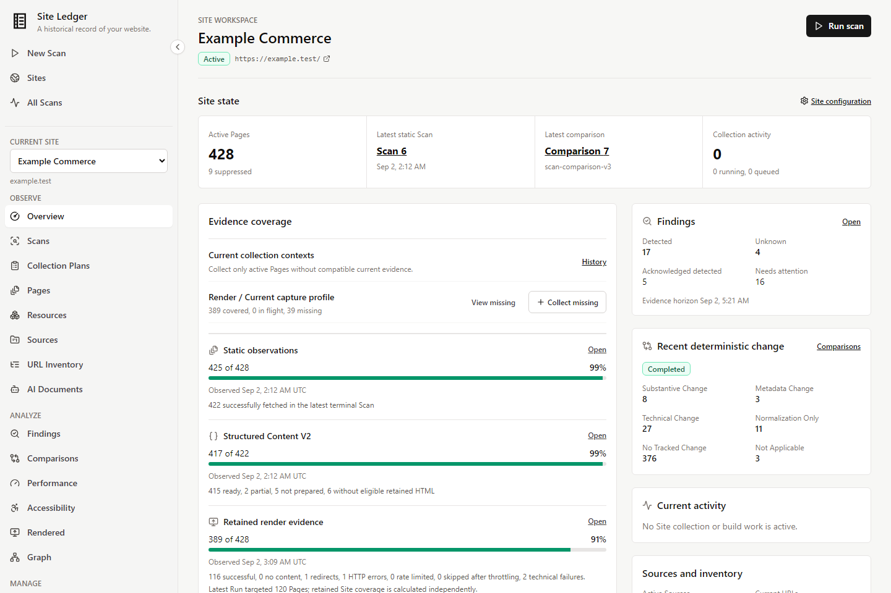
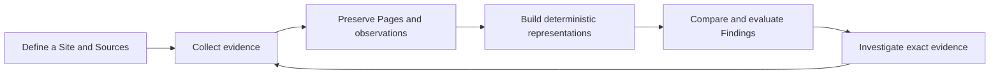
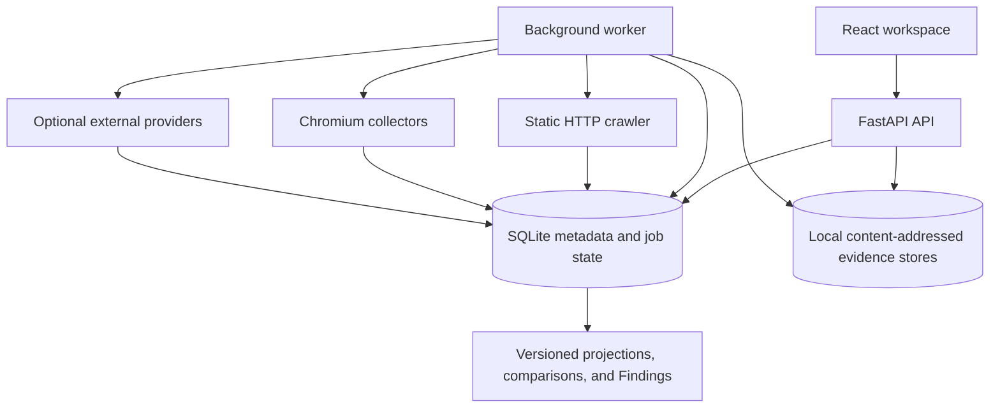
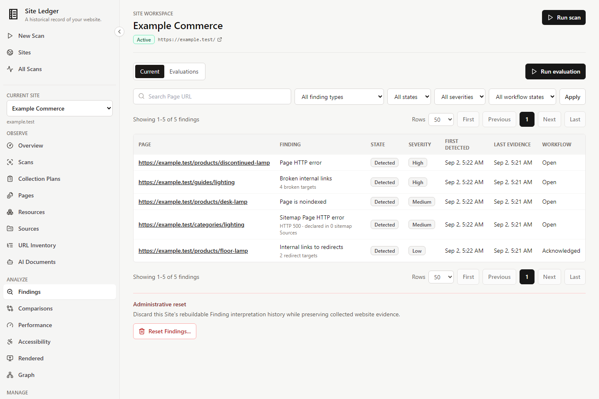
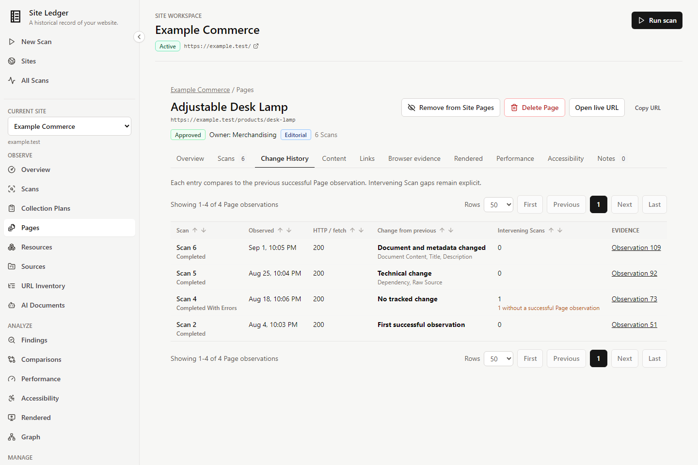
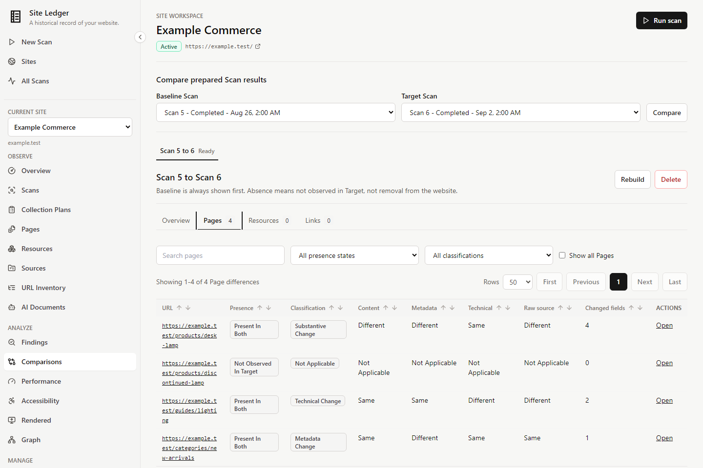
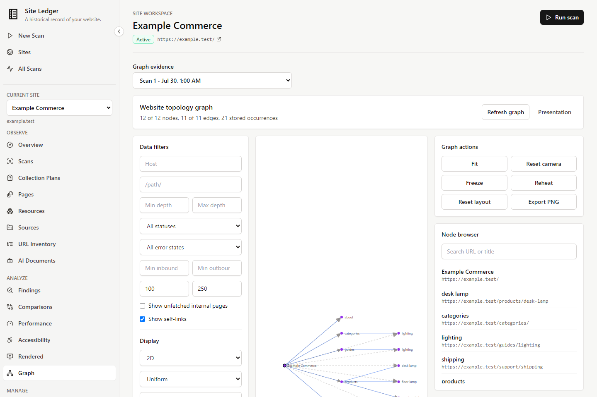

# Site Ledger

**A historical record of your website.**

[](https://github.com/Artsen/site-ledger/actions/workflows/ci.yml)


Site Ledger is a local-first website intelligence application. It crawls a website, keeps the
evidence it observes, and helps you investigate how the site changes over time.

Most crawlers produce a report about one moment. Site Ledger remembers Pages as persistent
identities, so later Scans, sitemap declarations, browser captures, performance measurements,
accessibility checks, structured content, comparisons, and Findings become one inspectable history.
It is built for website owners, content teams, SEO and web operations practitioners, and developers
who need evidence behind the answer, not just a current score.



## Contents

- [Status and scope](#status-and-scope)
- [Why Site Ledger exists](#why-site-ledger-exists)
- [A plain-English tour](#a-plain-english-tour)
- [Key capabilities](#key-capabilities)
- [Quick start](#quick-start)
- [How it works](#how-it-works)
- [Site Intelligence and Findings](#site-intelligence-and-findings)
- [History and comparison](#history-and-comparison)
- [Architecture and trust](#architecture-and-trust)
- [Gallery](#gallery)
- [Development](#development)
- [Privacy, security, and limitations](#privacy-security-and-limitations)
- [Documentation map](#documentation-map)

## Status And Scope

Site Ledger is a source-run local application under active development. These labels distinguish
what the current repository implements from planned direction.

| Area | State | What that means today |
| --- | --- | --- |
| Static website crawling | Available | Bounded HTTP collection with retained response and link evidence |
| Persistent Page history | Available | Page workspaces accumulate observations across Scans |
| Sitemap and URL Source evidence | Available | Sitemap, robots-discovered sitemap, manual URL, and AI document Sources |
| Scan comparison | Available | Deterministic same-Site Page, Resource, and link comparison |
| Browser-rendered evidence | Available | Explicit bounded Chromium Render Runs and retained artifacts |
| PageSpeed and CrUX evidence | Available | Independent provider observations when a Google API key is configured |
| Automated accessibility evidence | Available | Pinned axe-core checks; this is not WCAG certification |
| Structured Page Content | Available | Versioned document text, headings, sections, and deterministic Markdown |
| Site Intelligence | Available | Read-only coverage and activity rollup with independent evidence clocks |
| Deterministic Findings | Available | Evidence-backed static, topology, and sitemap/static conditions |
| Missing-current Collection Plans | Available | Bounded orchestration for evidence that is absent from the current identity |
| Scheduled recurring collection | Not yet | Collection remains manually initiated |
| Google Search Console and GA4 | Not yet | No analytics or search-performance integration |
| AI interpretation | Not yet | AI document evidence can be retained; no AI reasoning is implemented |
| Web Estate and platform discovery | Planned | Future domain, host, and platform intelligence |

## Why Site Ledger Exists

A website rarely changes in one clean, synchronized event. A Page can start returning a 404 while
its sitemap still declares it. A canonical can point to a broken target. Internal links can begin
passing through redirects. Browser evidence may be newer than the latest static Scan. A later
observation may prove that the condition was fixed.

A current-state report loses much of that context. Site Ledger preserves observations and their
provenance so you can ask:

- What did this Page look like in each Scan?
- Was the change in document copy, metadata, dependencies, links, or only normalized noise?
- Which exact observation supports a Finding?
- Which Pages still lack current render, performance, accessibility, or structured-content evidence?
- Was a Page absent from one Scan, or was it actually proven to be removed from the website?

The goal is not a universal health score. It is a durable record that makes operational conclusions
traceable.

## A Plain-English Tour

1. **Add a Site.** Save its starting URL, crawl boundary, and reusable collection settings.
2. **Define discovery inputs.** Add sitemaps or manual URL Sources alongside crawl discovery.
3. **Run a Scan.** The worker collects bounded static HTTP observations and link occurrences.
4. **Keep the Pages.** Page workspaces persist across Scans with ownership, workflow, categories,
   notes, and observation history.
5. **Collect independent evidence.** Run browser captures, Performance measurements,
   Accessibility audits, or Structured Content preparation on their own clocks.
6. **Compare Scans.** Inspect deterministic Page, Resource, and link differences without rewriting
   the original evidence.
7. **Evaluate Findings.** Detect explicit conditions and open the retained evidence behind them.
8. **Collect again later.** New evidence extends the history rather than replacing it.

## Key Capabilities

### Inventory And Discovery

- Crawl bounded website scope and keep exact redirect, failure, and link-discovery evidence.
- Refresh sitemap, robots-discovered sitemap, manual URL, and AI Document Sources.
- Maintain a current URL Inventory with source provenance, separate from observed Pages.
- Inventory observed and referenced non-HTML Resources without storing Resource bodies.

### Historical Evidence

- Keep persistent Page identities and Scan-specific observations.
- Retain exact HTML in compressed, content-addressed local storage.
- Extract deterministic document text, heading outlines, sections, and Markdown from retained HTML.
- Record rendered DOM, screenshots, network evidence, and browser outcomes in explicit Render Runs.
- Store immutable PageSpeed, CrUX, and automated Accessibility provider evidence.

### Change Investigation

- Compare prepared Scans using versioned deterministic algorithms.
- Separate substantive document changes, metadata changes, technical/source changes, narrow
  normalization-only changes, and unchanged tracked state.
- Explore URL hierarchy and observed Page links in bounded 2D or 3D topology views.
- Follow every comparison result back to its exact Page observations.

### Findings And Site Intelligence

- Roll up current Page population, evidence coverage, collection clocks, active work, comparisons,
  Sources, and Findings without pretending they share one timestamp.
- Evaluate deterministic Findings for HTTP/fetch failures, indexability and canonical problems,
  internal-link topology, and sitemap/static conflicts.
- Track Finding lifecycle as detected, unknown, resolved, reopened, and acknowledged.
- Retain typed evidence references and bounded, deterministic evidence samples.

### Organization And Durable Operations

- Add Page categories, automatic Category Rules, owners, workflow states, and notes.
- Queue Scans, Source refreshes, collection work, projections, comparisons, and Finding evaluations
  as durable background jobs.
- Cancel, retry, inspect, and recover work through explicit lifecycle state.
- Delete selected evidence or rebuildable Finding history with clear preservation boundaries.

## Quick Start

The contributor setup is pinned to Python 3.11, uv 0.12.3, Node.js 20.19 or newer, and npm 10.8.2.
Install [uv](https://docs.astral.sh/uv/) and Node.js before starting.

```powershell
git clone https://github.com/Artsen/site-ledger.git
cd site-ledger

cd backend
uv sync --extra dev --locked
uv run playwright install chromium
uv run python -m app.browser_check
uv run alembic upgrade head
```

Install the frontend in another terminal:

```powershell
cd frontend
npm ci
```

Run the API, worker, and frontend in three terminals:

```powershell
# Terminal 1
cd backend
uv run uvicorn app.main:app --reload

# Terminal 2
cd backend
uv run python -m app.worker

# Terminal 3
cd frontend
npm run dev
```

Open [http://127.0.0.1:5173](http://127.0.0.1:5173). The API defaults to
`http://127.0.0.1:8000`. Collection jobs remain queued when no worker is running.

Performance collection is optional. Set `SITE_LEDGER_GOOGLE_API_KEY` in both backend process
environments before starting the API and worker when PageSpeed or CrUX evidence is needed. Runtime
databases and evidence stores are written under `data/` and ignored by Git.

## How It Works

### Product Workflow



### How Site Ledger Thinks About A Website

A **Site** is the workspace and collection boundary. A **Page** is a persistent URL identity within
that Site. Each Scan or independent collector adds an **Observation** without replacing earlier
evidence. Internally, Site membership and workspace state are represented by `SitePage`, normalized
URL identity by `WebResource`, and an exact static observation by `ResourceSnapshot`.

Not all evidence is collected together:

| Evidence domain | Clock | Primary role |
| --- | --- | --- |
| Static Scan | Per Scan | HTTP response, metadata, exact HTML, Resources, and links |
| Source and sitemap evidence | Per Source refresh | Declared URL membership and source provenance |
| Render evidence | Per Render Run | Browser outcome, DOM, screenshots, network, and console evidence |
| Performance | Per provider observation | PageSpeed lab and CrUX field data |
| Accessibility | Per Page/profile audit | Automated axe-core results and affected nodes |
| Structured Content | Per retained HTML derivative | Document text, outline, sections, and Markdown |

Site Ledger does not pretend that "the latest Scan" is the complete current state of a Site. Each
domain reports its own observation time, coverage, compatibility, and gaps. See
[Architecture](docs/architecture.md) and [Site Intelligence](docs/site-intelligence.md).

## Site Intelligence And Findings

**Site Intelligence** is a current, read-only rollup. Its denominators are the active Page
population, and its evidence panels retain separate clocks. Missing Performance or Accessibility
evidence is shown as missing, not interpreted as a good result.

**Findings** are deterministic, evidence-backed operational conditions. They are not probabilistic
advice. Each evaluation records the detector bundle, selected evidence, outcomes, and exact
references supporting persisted Findings. Current detectors cover static Page state, internal-link
topology, and sitemap/static cross-stream conditions. Administrative reset and delete controls
remove rebuildable Finding interpretation history while preserving collected website evidence.

See [Findings](docs/findings.md) for lifecycle and detector semantics.

## History And Comparison

Pages persist even when individual Scan observations differ or are absent. Scan Comparison builds
an immutable, versioned view between two prepared terminal Scans and links differences back to the
source observations. "Not observed in Target" is deliberately not presented as proof that a Page
was deleted from the live website.

Exact source evidence is never normalized in place. Narrow meaningful-source normalization and
document-content extraction are separate deterministic representations, so technical churn can
remain visible without being mislabeled as changed Page copy. See
[Scan comparisons](docs/scan-comparisons.md) and
[Page history and reuse](docs/page-history-and-reuse.md).

## Architecture And Trust

### Architecture At A Glance



The FastAPI backend owns APIs, collection services, evidence persistence, and the durable job
queue. A standalone worker claims jobs and runs static, browser, provider, and derivative work.
SQLite stores relational evidence and lifecycle state; large retained payloads use local
content-addressed stores. The React workspace reads those APIs and lazy-loads graph renderers.

### Evidence And Trust Model

- **Exact evidence stays exact.** Derived normalization, extraction, projections, comparisons, and
  Findings are separate versioned artifacts.
- **Absence is not deletion.** A failed collector or a missing Scan observation does not prove a
  live Page disappeared.
- **Clocks stay independent.** Static, sitemap, rendered, Performance, Accessibility, and derived
  evidence do not inherit an invented universal timestamp.
- **Provenance is explicit.** Algorithm identities, provider versions, checksums, evidence links,
  and job attempts remain inspectable.
- **Mutable workflow stays separate.** Owners, categories, notes, acknowledgements, and Page
  workspace state do not rewrite immutable observations.
- **Rebuildable does not mean authoritative.** Projections and Findings can be rebuilt; retained
  source observations remain the authority.

Read the full [architecture](docs/architecture.md), [URL identity contract](docs/url-identity-contract.md),
[scan projection contract](docs/scan-projections.md), and [background job contract](docs/background-jobs.md).

## Gallery

| Evidence-backed Findings | Persistent Page history |
| --- | --- |
|  |  |

| Deterministic Scan comparison | Website topology |
| --- | --- |
|  |  |

The gallery uses a deterministic mocked Playwright fixture named **Example Commerce**. It contains
no live, customer, personal, or retained user data. See [Writing style](docs/writing-style.md) for
the screenshot maintenance rules.

## Development

### Repository Layout

```text
.
|-- backend/              FastAPI API, worker, models, migrations, and service tests
|-- frontend/             React workspace, unit tests, and Playwright UI tests
|-- docs/                 Product, operator, evidence, and architecture documentation
|   `-- brain/            Maintained architecture and context navigation
|-- tools/                Operational, migration, benchmark, and verification utilities
`-- data/                 Local runtime databases and evidence stores; ignored by Git
```

### Development Commands

| Check | Command |
| --- | --- |
| Backend tests | `cd backend; uv run --extra dev --locked pytest` |
| Ruff lint | `cd backend; uv run --extra dev --locked ruff check . ../tools` |
| Ruff format | `cd backend; uv run --extra dev --locked ruff format --check . ../tools` |
| Strict MyPy | `cd backend; uv run --extra dev --locked mypy app` |
| Frontend lint | `cd frontend; npm run lint` |
| TypeScript | `cd frontend; npm run typecheck` |
| Frontend tests | `cd frontend; npm run test` |
| Production build | `cd frontend; npm run build` |
| Mocked Playwright | `cd frontend; npm run e2e` |
| Full-stack Golden Path | `uv run --project backend --extra dev --locked python tools/run_full_stack_e2e.py` |
| README screenshot review | `cd frontend; npm run review:readme-screens` |

GitHub Actions runs Backend, Frontend, Playwright, and Golden Path jobs. The mocked Playwright suite
provides broad deterministic UI coverage; the Golden Path exercises the real React, API, worker,
crawler, SQLite, evidence, projection, comparison, and UI lifecycle on a local fixture. See
[Full-stack testing](docs/full-stack-testing.md).

Historical projection preparation, structured-content preparation, evidence garbage collection,
URL identity migration, dependency maintenance, benchmark commands, and detailed collection limits
are documented in their focused operator and architecture guides below. The URL identity migration
is an explicit offline workflow; never run it against retained data without following
[its preflight and confirmation process](docs/url-identity-migration.md).

## Privacy, Security, And Limitations

### Privacy And Security

Site Ledger is local-first: SQLite state, captured HTML, browser artifacts, and provider payloads
remain in local stores unless the operator deliberately moves or exports them. Stored HTML is
rendered as escaped source in the application, not executed by the dashboard. External Performance
provider requests occur only when configured and initiated.

Collection destinations are treated as hostile. Static and browser collectors enforce explicit
network policy, reject unsafe address classes by default, revalidate redirects, avoid ambient proxy
and credential forwarding, and apply request, response-size, depth, Page, and run bounds. Browser
capture remains subject to documented Chromium DNS/connection timing limits. Read
[Network security](docs/network-security.md) before enabling private-network access.

### Current Limitations

- Site Ledger is a source-run local application, not a hosted service or stable release.
- Static crawling does not execute JavaScript; browser rendering is a separate explicit collector.
- Collection is manual. Collection Plans select missing-current evidence but do not schedule future
  work or model freshness yet.
- There is no GSC, GA4, AI interpretation, full visual regression, or performance-regression engine.
- Automated Accessibility evidence is useful test output, not WCAG certification.
- Static crawling is sequential within a run; broad concurrent collection and robots enforcement
  remain deferred.
- SQLite and local evidence stores impose practical limits on concurrent and very large workloads.
- Graph responses are capped at 3,000 nodes and 10,000 edges; filters and focused neighborhoods are
  preferable for dense Sites. The optional 3D renderer is a large lazy-loaded bundle.
- The production npm audit currently reports two moderate React Router advisories; high and critical
  production findings are CI-blocking.

## What's Next

The next substantive product area is **Collection Plans V2**: `refresh_current`, explicit freshness
semantics, and stale-current groundwork. Longer-term direction includes recurring scheduling,
GSC/GA4 evidence, broader cross-domain correlation, Web Estate and platform intelligence, and
evidence-grounded AI interpretation. These are plans, not current capabilities.

## Documentation Map

### Getting Started

- [Product workspace navigation](docs/workspace-navigation.md)
- [Scan configuration policy](docs/scan-configuration-policy.md)
- [Page workspaces](docs/page-workspaces.md)

### Users And Operators

- [Site Intelligence](docs/site-intelligence.md)
- [Findings](docs/findings.md)
- [Scan comparisons](docs/scan-comparisons.md)
- [Collection Plans](docs/collection-plans.md)
- [Structured Page Content](docs/structured-page-content.md)
- [Browser-rendered observations](docs/browser-rendered-observations.md)
- [Performance observations](docs/performance-observations.md)
- [Automated Accessibility observations](docs/accessibility-observations.md)
- [Resource Inventory](docs/resource-inventory.md)
- [AI Document Sources](docs/ai-document-sources.md)
- [Network security](docs/network-security.md)

### Developers

- [Product vision](docs/product-vision.md)
- [Architecture](docs/architecture.md)
- [URL identity contract](docs/url-identity-contract.md)
- [URL identity migration](docs/url-identity-migration.md)
- [Background jobs](docs/background-jobs.md)
- [Scan projections](docs/scan-projections.md)
- [Website graph](docs/website-graph.md) and [graph performance](docs/graph-performance.md)
- [Page history and reuse](docs/page-history-and-reuse.md)
- [Page Category Rules](docs/page-category-rules.md)
- [Full-stack testing](docs/full-stack-testing.md)
- [Documentation writing style](docs/writing-style.md)

### Coding Agents And Architecture Navigation

- [Second brain overview](docs/brain/README.md)
- [Agent guide](docs/brain/AGENT_GUIDE.md)
- [Context packs](docs/brain/CONTEXT_PACKS.md)
- [Invariants](docs/brain/INVARIANTS.md)
- [Current development frontier](docs/brain/FRONTIER.md)
