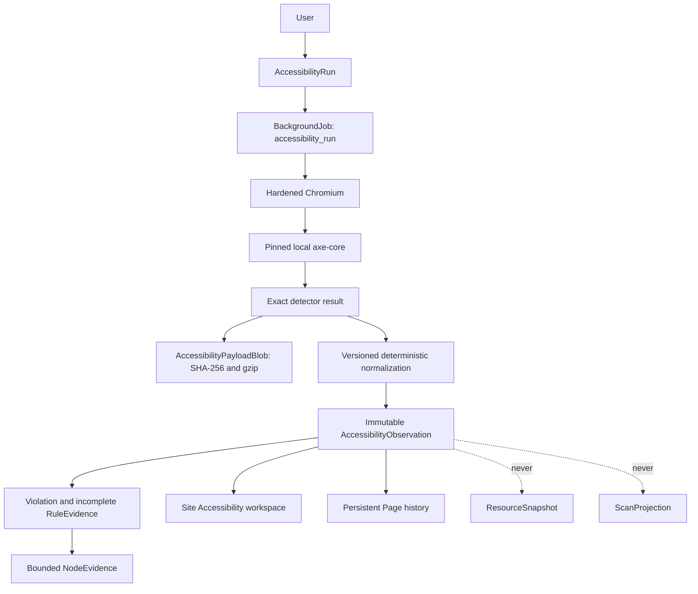

# Automated Accessibility Observations

Site Ledger collects deterministic automated Accessibility evidence independently of Scans. A run
loads a known persistent Page in the existing hardened Chromium renderer, injects a locally pinned
axe-core detector after bounded page readiness, retains the exact result, and creates immutable
queryable evidence. Collection is manual and on demand.

Automated testing cannot establish WCAG conformance. Site Ledger reports **Violations** and
**Needs Review** evidence without labeling a Page accessible, inaccessible, compliant, or
non-compliant. Manual testing remains necessary for requirements that automation cannot evaluate.

## Evidence Ownership

An `AccessibilityObservation` belongs to one `AccessibilityRun`, persistent Page/WebResource, and
Desktop or Mobile profile at its own observation time. It is not evidence from an earlier Scan even
when both domains use Chromium.

`AccessibilityRun` stores canonical requested Page IDs and profiles plus mutable lifecycle
counters. `AccessibilityObservation` stores terminal outcome, Page/profile identity, exact browser
configuration, detector and browser provenance, aggregate result counts, payload reference, and a
normalized evidence hash. Database uniqueness on run, Page, and profile makes job reclaim
idempotent. Later audits create later observations; terminal evidence is not rewritten.

`AccessibilityPayloadBlob` stores canonical axe result JSON bytes by uncompressed SHA-256 using
deterministic gzip. Byte-identical results share storage without merging observations. The exact raw
result is authoritative and retains `violations`, `incomplete`, `passes`, and `inapplicable`.

Only violations and incomplete results are normalized relationally. Rule rows preserve detector
rule ID, result type, null-capable impact, description, guidance, HTTPS help link, tags, node count,
and deterministic hash. Node rows preserve structured target arrays, failure summary, and escaped
HTML text. HTML snippets are limited to 4,096 characters with original length and truncation state;
the complete snippet remains in the raw payload. Passing and inapplicable results retain aggregate
counts and exact raw evidence without creating thousands of relational rows.

## Standards And Detector

The initial automated profile targets axe rules tagged for WCAG 2.0, 2.1, or 2.2 Level A/AA:

`wcag2a`, `wcag2aa`, `wcag21a`, `wcag21aa`, `wcag22a`, `wcag22aa`

This profile does not represent all WCAG 2.2 success criteria. It intentionally excludes
best-practice-only and experimental disabled rules.

| Identity | Value |
| --- | --- |
| axe-core | `4.12.1` |
| Detector bundle SHA-256 | `66a8aaa95a8b044a7fd74a5435873bf04ff65a1ca75567c921b7509742085a14` |
| Integration | `accessibility-engine-v1` |
| Normalization | `accessibility-normalization-v1` |
| Ruleset profile | `wcag22-aa-v1` |
| Effective enabled rules | 62 |
| Ruleset SHA-256 | `9e529b185ca8f212dc39924c0f2e6208115e44c1baf0052128a00080212705a5` |

The worker reads `backend/app/accessibility/vendor/axe.min.js`; it never loads detector code from a
CDN or depends on frontend/global npm installation. Each audit verifies the bundle and ruleset file
checksums, `window.axe.version`, runtime enabled rule metadata, and the result's `testEngine`
version. The page cannot silently replace detector identity before persistence.

The vendored distributable comes from the official axe-core npm package and is licensed under
MPL-2.0. `LICENSE` and `LICENSE-3RD-PARTY.txt` are retained beside the bundle. To update it, obtain
one exact official package version, copy its unmodified minified bundle and notices, derive the
enabled WCAG-tagged rule metadata with that same bundle, update explicit version/checksum constants,
and run the real Chromium identity test. Detector updates create new provenance; they never rewrite
history.

## Deterministic Profiles

| Profile | Viewport | Device scale | Locale | Timezone | Color | Motion |
| --- | --- | ---: | --- | --- | --- | --- |
| Desktop | 1440 x 900 | 1 | en-US | UTC | light | reduce |
| Mobile | 390 x 844 | 1 | en-US | UTC | light | reduce |

These are viewport profiles, not claims of physical-device emulation. Responsive results remain
separate observations. A user sees the exact cost before starting a run: selected Pages multiplied
by selected profiles. Default selection guidance is 10 Pages; the hard configured cap is 25 Pages
and at most two profiles, for at most 50 logical audits. Invalid requests are rejected, not
truncated. Browser observations execute serially under the configured worker concurrency.

## Browser Security And Readiness

Accessibility uses `BrowserRenderer`, not a weaker or separate browser stack. It inherits current
scope and destination validation, private-network default denial, redirect validation, allowed
methods, disabled service workers, popup/download restrictions, no ambient proxy, bounded duration,
per-resource byte limits, total network byte limits, privacy redaction, and bounded load settling.
`allow_private_networks` remains a Site-level explicit choice; local fixtures enable it deliberately.

The renderer waits for bounded navigation and its existing readiness policy, then invokes the axe
callback. It does not wait indefinitely for network idle or use a fixed sleep. Detector injection
modifies the page, so no post-injection DOM is stored as ordinary Scan browser evidence.

The browser DNS residual risk documented in [Network security](network-security.md) remains: Python
validates destinations, but Chromium performs its own resolution. Accessibility inherits the same
boundary and does not claim to eliminate browser DNS rebinding.

## Jobs And Query Semantics

The durable `accessibility_run` job builds a deterministic Page/profile worklist, opens one Chromium
session, commits each observation independently, updates progress, and checks cancellation between
audits. A run ends `completed`, `completed_with_errors`, `cancelled`, `interrupted`, or `failed` as
appropriate. Committed evidence survives partial failure and cancellation. Lease recovery settles
both job and run, and already committed logical observations are skipped during reclaim.

"Latest" means the latest attempt per Page/profile. A newer failed audit is never hidden behind an
older ready result. Site summary, Page summary, and Rules use this latest population. Rule
aggregation includes normalized rows only from latest ready observations; latest failed profiles
remain visible as failed and do not contribute stale historical rules. This is a current evidence
snapshot, not regression classification.

Site APIs include capabilities, run create/list/detail/cancel, summary, current Page summaries,
latest observations, current rule aggregation/detail, and Site-owned observation metadata. Page
APIs expose latest Desktop/Mobile and paginated history. Raw payload responses are `text/plain`,
`nosniff`, and `private, no-store`; React renders them and detector snippets as escaped text.

## Workspace

`/sites/:siteId/accessibility` provides URL-backed Overview, Pages, Rules, and Runs views. Overview
reports counts without a score. Pages provide server-side search, filters, sorting, and pagination.
Rules distinguish Violations from Needs Review and link to paginated affected-element evidence.
Runs poll while active and expose effective ruleset identity and per-observation status. Nested run,
rule, and raw routes return to the destination Site's Accessibility root when switching Sites.

Persistent Page workspaces include latest Desktop/Mobile states, immutable history, raw evidence,
and a one-Page audit action through the same run API. Accessibility does not appear on Scan
Observation pages.

## Measured Scale

The manual `python -m app.accessibility_benchmark` fixture created 5,000 Pages, 20 runs, 20,000
observations, 20,000 rule rows, and 20,000 node rows. On the development Windows/SQLite environment:

| Query | p50 | p95 |
| --- | ---: | ---: |
| Latest Page summaries, first 100 | 152.6 ms | 171.2 ms |
| Current rule aggregation | 137.0 ms | 149.1 ms |
| One Page history | 91.0 ms | 95.7 ms |
| Rule occurrences, first 50 | 165.2 ms | 187.7 ms |
| Run list | 3.4 ms | 4.2 ms |

The synthetic database was 35,561,472 bytes. Its representative raw payload was 1,826 bytes and
329 bytes under deterministic gzip.

A separate real Chromium pass used Chromium `151.0.7922.34` and the local axe bundle. Browser
startup/session creation took 540.8 ms. Clean Desktop and Mobile fixtures took 578.8 ms and
526.7 ms, retained about 31.2 KiB raw / 5.1 KiB gzip each, and normalized zero rule/node rows. A
fixture with 30 missing-alt images took 857.4 ms Desktop and 1,000.8 ms Mobile, retained about
76.1 KiB raw / 6.1 KiB gzip, and normalized one rule plus 30 node rows for each profile. These
measurements are diagnostics, not CI thresholds.

## Non-Goals

This domain does not implement WCAG certification, an Accessibility score, Findings, remediation
workflow, manual review records, regression detection, baselines, schedules, notifications, AI
interpretation, Lighthouse Accessibility, screenshots per affected node, Scan Comparison changes,
or changes to Performance, projections, structured content, or browser security versions.
