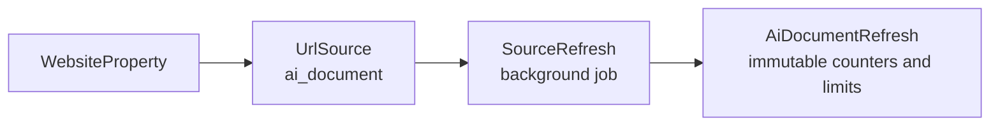
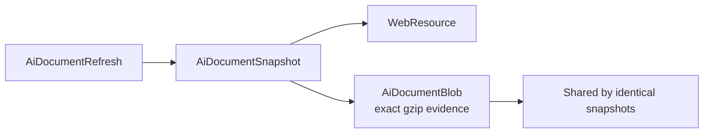
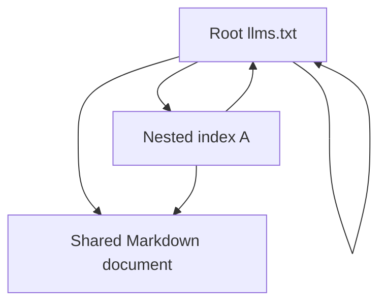
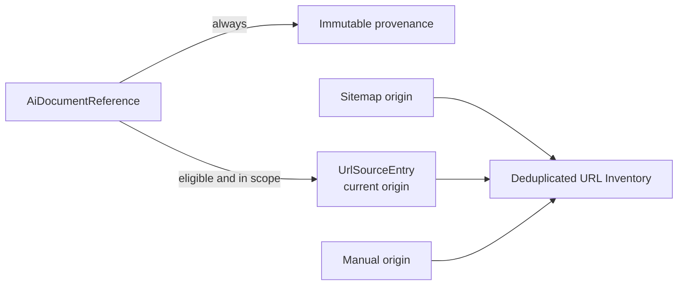
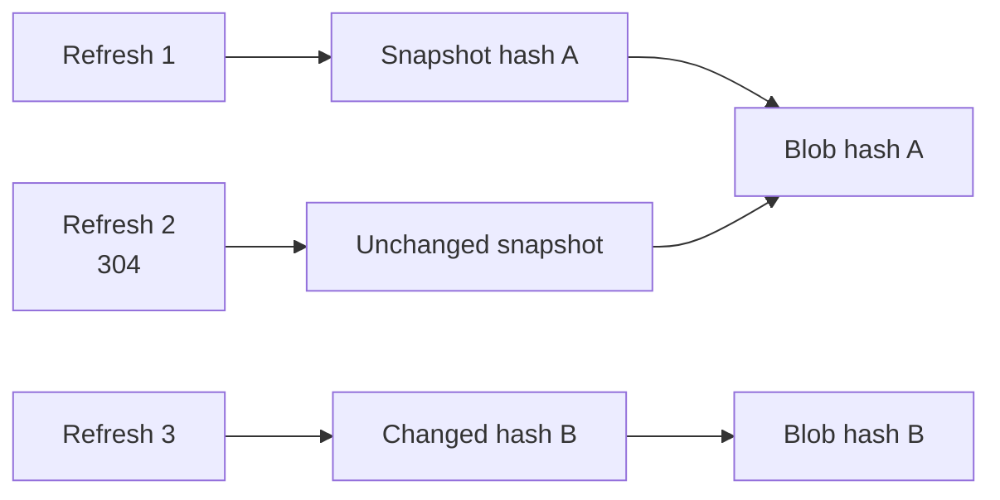
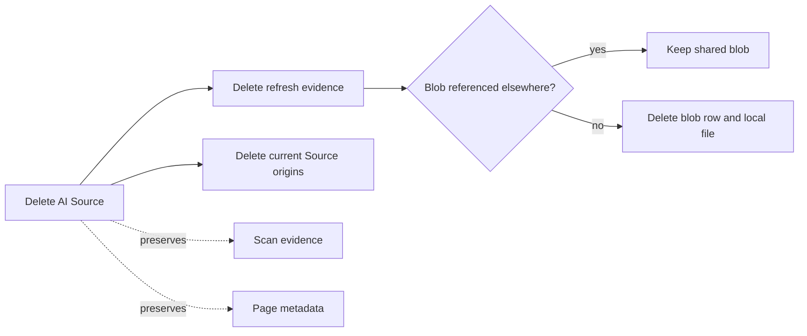

# AI Document Sources

AI Document Sources preserve AI-readable index and content documents as Site-scoped Source
evidence. A Source commonly starts at `/llms.txt`, but it may use `/.well-known/llms.txt`, an
advertised nested path, or a manually configured in-scope URL. The feature name covers indexes,
corpus files, Markdown, text, JSON, YAML, OpenAPI, and AsyncAPI documents; these are not all called
llms.txt files.

An AI Document Source is not a Scan. Refresh requests do not create `ResourceSnapshot` rows, change
Scan counters, mutate Page metadata, add graph edges, invoke browser rendering, or create findings.
Eligible declared URLs may become current `UrlSourceEntry` origins and may later be selected by a
normal Scan.

## Terminology And Persistence

- **AI Document Source:** configured or discovered Site-scoped entry point.
- **AI Document:** normalized URL identity backed by the existing `WebResource` model.
- **AI Document Snapshot:** immutable evidence for one retrieval in one Source refresh.
- **AI Document Reference:** one duplicate-preserving declaration from a parent document.
- **AI Index:** a structurally supported index, normally `llms.txt`.
- **AI Content Document:** an accepted textual document declared by an index.
- **Corpus Document:** an aggregate such as `llms-full.txt`; retained but not recursively parsed as
  an index by default.

`AiDocumentBlob` is deliberately separate from HTML-only `ContentBlob`. It uses the same local,
gzip-compressed, SHA-256-addressed storage pattern without putting AI bytes into Resource Inventory.
Exact bytes are hashed before decoding, so BOM bytes and line endings remain evidence.

## Discovery

Bounded Site discovery checks `/llms.txt`, `/.well-known/llms.txt`, supported `Link` relations
(`llms-txt` and `llms-full-txt`), and the nonstandard `X-Llms-Txt` hint. Candidates are normalized,
deduplicated, safety checked, and presented before configuration. Discovery does not recursively
ingest a tree and does not probe every directory. Manual nested entry points must pass Site scope.
Existing Sources are identified rather than replaced.

Every destination and redirect passes the safe HTTP boundary: HTTP(S) only, public-network policy,
bounded redirects, timeout, retries supplied by the Source job, and response-size limits. Cookies,
credentials, remote scripts, remote styles, and remote rendering are never used.

## Parsing And Classification

Parser version `ai-document-parser-v1` uses the CommonMark token tree from `markdown-it-py`, a
pure-Python dependency. It supports a UTF-8 BOM, H1 title, blockquote summary, introductory prose,
H2 sections, nested formatting around links, relative and absolute URLs, protocol-relative URLs,
queries, fragments, duplicate declarations, and the special `Optional` section. Missing H1 and
recoverable malformed structures become neutral diagnostics.

Classification records its rule. Strong evidence such as an explicit discovery relation or exact
`llms.txt` filename precedes MIME, bounded content signatures, parent context, and extension. A
`.txt` suffix alone does not make a document an index. `llms-full.txt` is an optional corpus: it is
saved within limits but links in arbitrary prose are not recursively crawled. HTML and unsupported
binary responses retain metadata without retaining their bodies.

## Nested Graph

Nested indexes form a directed graph rather than a strict tree. Each normalized URL is fetched at
most once per refresh, while every declaration and position remains a separate reference. Minimum
depth, multiple parents, duplicate declarations, self-links, and cycles remain visible. The UI uses
a tree-oriented ordering and explicitly marks multiple parents and cycles.

Default copied limits are depth 5, 100 indexes, 1,000 documents, 10,000 references per document,
5 MB per document, 100 MB retained, and 250 MB transferred. Hard validation caps these at depth 10,
1,000 indexes, 5,000 documents, 20 MB per document, 500 MB retained, and 1 GB transferred. Budget
exhaustion preserves partial evidence and completes with diagnostics. External documents are not
followed by default; explicit opt-in still uses the public destination policy. Cancellation is
checked between documents.

## URL Inventory

Every declaration remains an `AiDocumentReference`. Eligible in-scope HTTP(S) Page or textual
candidates also become current `UrlSourceEntry` origins with refresh, parent snapshot, parent URL,
section, label, description, position, optional status, depth, raw URL, and resolved URL provenance.
External and out-of-scope links remain references but are not default crawl seeds. Nested index and
corpus URLs are not treated as ordinary Page candidates solely because the Source fetched them.

Current membership is replaced only after a bounded refresh has built its accepted origin set.
Historical snapshots and references remain immutable. Other sitemap, robots, and manual origins for
the same `WebResource` coexist.

## Refresh History And Conditional Requests

AI Sources use the existing durable `source_refresh` background job, lease, heartbeat, cancellation,
Activity, and worker-health lifecycle. Each run copies effective settings into `AiDocumentRefresh`.
Child failures become retained diagnostics and do not normally destroy the refresh. Fatal database,
storage, or orchestration failures fail the run.

ETag and Last-Modified validators are reused when available. A 304 creates a new snapshot that
references the prior blob and is marked unchanged. Identical full responses also share blobs by
hash. Prior snapshots are never mutated.

## Workspace And Saved Evidence

The Source workspace provides Overview, Tree, Files, Declared URLs, Validation, History, and
Settings. Files, references, and refresh history use shared server pagination. The saved-file view
shows retrieval metadata and exact retained text as escaped monospace content. Loading is explicit;
Markdown is not rendered, `dangerouslySetInnerHTML` is not used, remote assets are not embedded,
and downloads use an attachment response with `nosniff`.

Validation language is evidence based: found, not found, declared, fetched, saved, changed,
malformed, external, out of scope, skipped by limit, or unsupported representation. Site Ledger
does not claim every Site needs llms.txt, that its absence affects SEO or model access, that it
overrides robots, or that `llms-full.txt` is required.

## Deletion And Garbage Collection

Deletion previews count refreshes, snapshots, references, current origins, shared/exclusive blobs,
and reclaimable compressed bytes. Deleting a Source removes its jobs, refresh evidence, references,
and current origins. Shared blobs and `WebResource` identities referenced by Pages, Scans, other
Sources, or other AI snapshots remain. Database cleanup commits before physical exclusive files are
removed.

## Current Limits And Future Work

The first implementation does not probe arbitrary paths, follow external documents by default,
render remote content, parse PDF/Office/archive files, run LLMs, create embeddings, provide vector
search or chat, generate summaries, create findings, or change graph semantics. Full content diffs,
source comparison, text search, LLM ingestion/export, and explicit Page-to-Markdown relationships
are future work.
