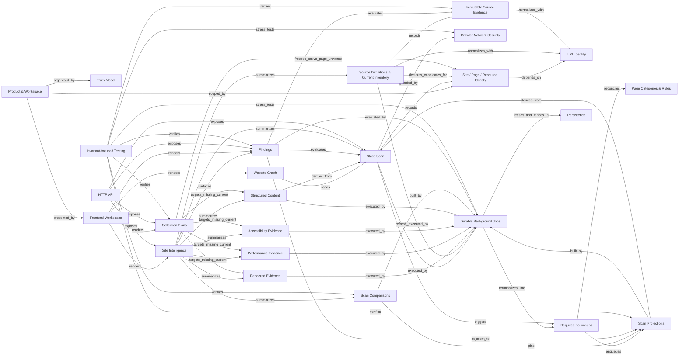

# Site Ledger Knowledge Graph

Canonical snapshot: `main@6e17e08e641b48660a7ed7a13d9227b288fcafc6` (2026-09-03).

This is a generated human-readable projection of `graph.json`. Edit `graph.json`, then regenerate this file.

