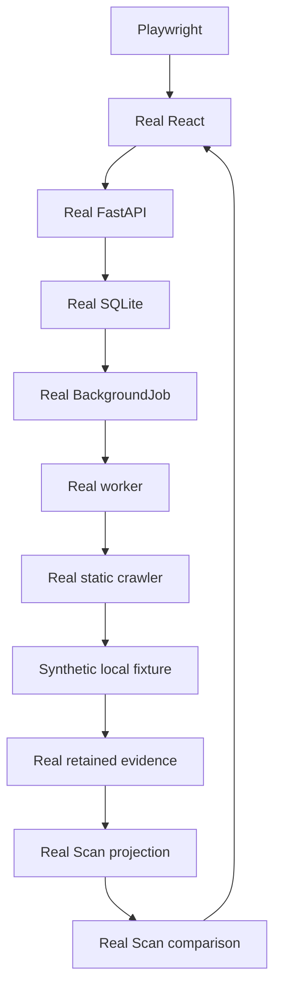

# Full-Stack Golden Path

The Golden Path is a separate Playwright suite that exercises the real React application,
FastAPI service, SQLite database, background worker, static crawler, derivative builders, and a
deterministic local fixture. It does not intercept or mock Site Ledger API requests.



Run it from the repository root after installing the locked backend and frontend dependencies and
Playwright Chromium:

```powershell
uv run --project backend --extra dev --locked python tools/run_full_stack_e2e.py
```

The orchestrator allocates dynamic loopback ports and a unique temporary workspace. It migrates a
fresh SQLite database, starts the fixture, API, worker, and Vite server, waits for bounded readiness
probes, runs the browser workflow, verifies persisted evidence directly, and shuts every child down.
Successful workspaces are removed. Failures are copied to `golden-path-artifacts/` with bounded
service logs, fixture requests, Playwright traces/screenshots, and the run manifest.

The fixture starts at version 1 with four Pages. Version 2 changes direct body copy on `/`, changes
only the title on `/pricing/`, changes only a script dependency query on `/technical/`, leaves
`/unchanged/` byte-identical, and adds `/new/`. The suite explicitly enables the existing
`allow_private_networks` Site scope option so the crawler can reach the loopback fixture; the
production default remains blocked.

Expected Page results are intentionally narrow:

- `/`: `substantive_change`; document identity changes and heading outline stays stable.
- `/pricing/`: `metadata_change`; title changes while structured document identity stays stable.
- `/technical/`: `technical_change`; exact source retains `build=1` to `build=2` while structured
  document and outline identities stay stable.
- `/unchanged/`: `no_tracked_change`; exact ContentBlob and compatible structured artifact are
  reused.
- `/new/`: `not_applicable` with Target-only, newly-observed presence.

The browser creates the Site through the real API, starts both Scans through the real UI, waits for
the real worker and automatic projection/comparison jobs, and inspects comparison and Observation
content screens. Direct database verification checks classification totals, blob and structured
artifact reuse, deterministic hashes, projection identities, completed jobs, foreign keys, and
duplicate artifact identities.

The regular `npm run e2e` suite remains the fast mocked UI regression suite. Use
`npm run e2e:full-stack` only through the orchestrator because it requires all disposable services
and environment variables to be ready.

CI runs this as the separate stable `Golden Path` check. Dependency setup may use package registries,
but the running workflow crawls only its loopback fixture. On failure, CI uploads the synthetic-only
diagnostics directory for seven days; the database is not uploaded by default.

This path intentionally covers the static crawler only. It does not require browser-rendered
observations, ETag/304 behavior, AI Documents, URL Sources, public-network crawling, or security
hardening. Those behaviors belong in focused lower-level tests or dedicated future system paths.
