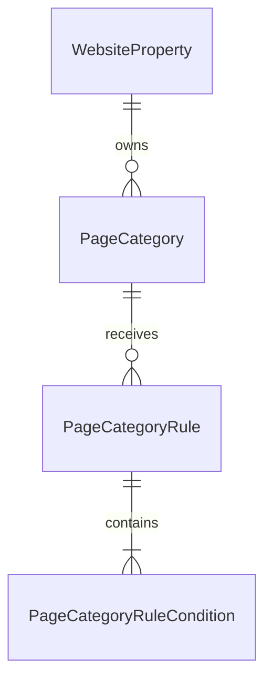
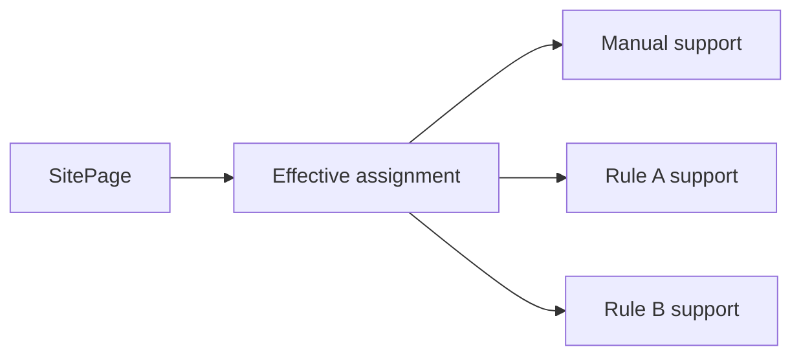
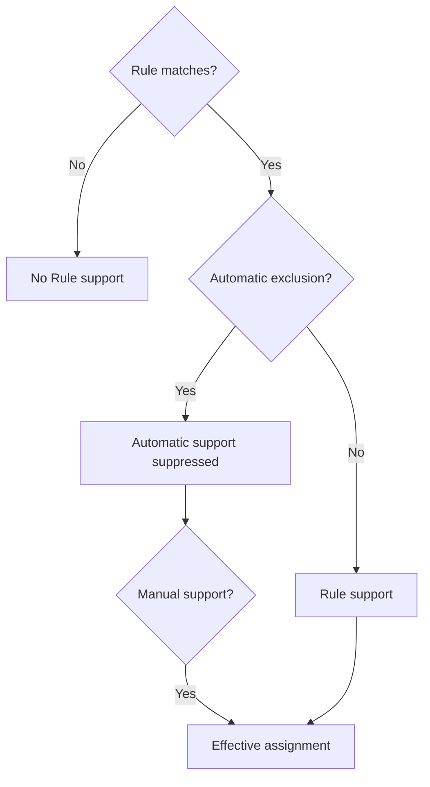
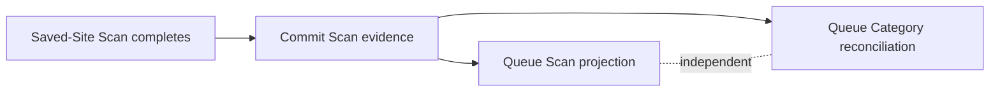
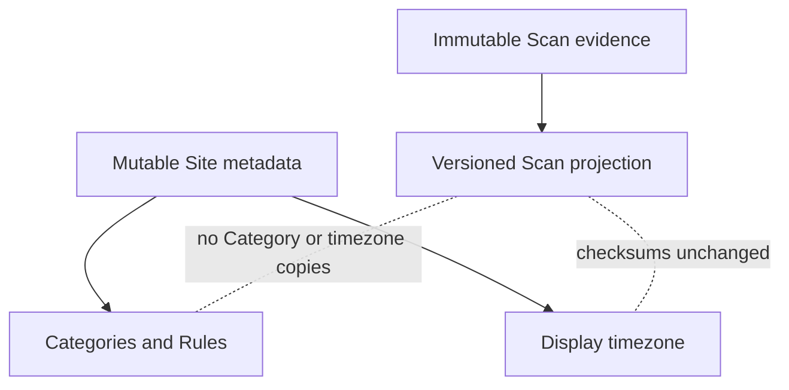

# Page Category Rules

Page Category Rules organize persistent Site Pages using deterministic URL identity fields. They
change mutable Site metadata only; they never alter Scan observations or immutable Scan
projections. The evaluator identity is `page-category-rules-v1`.

## Model And Terminology

A Rule belongs to one Site, targets one active Category, and contains one or more ordered
conditions. `all` requires every condition result to be true; `any` requires at least one. Negation
is applied to each condition before the mode is evaluated.

`PageCategoryAssignment` remains the effective Page-to-Category relation. Provenance is normalized
into manual and Rule support rows. Several Rules and one manual support may coexist.

An effective assignment exists when manual support exists, or when at least one active Rule
supports it and no automatic exclusion exists. An exclusion suppresses all automatic support for
one Page/Category but never blocks an explicit manual assignment.

Existing assignment rows are migrated as manual support and retain their original `assigned_at`
instant as the support creation time. Manual Page editing changes manual support only. Removing
manual support leaves a Category effective when an unsuppressed Rule still supports it.

## Conditions

Targets are `normalized_url`, `host`, `path`, `query`, and `filename`. Filename is the final path
segment only; directory paths ending in `/` have an empty filename and do not imply `index.html`.
Fragments do not participate.

Operators are `equals`, `starts_with`, `ends_with`, `contains`, `glob`, and `regex`. Glob supports
`*` and `?` over the selected text target, not filesystem traversal. Host matching is always
case-insensitive. Other targets default to case-insensitive matching and may explicitly enable
case sensitivity.

Patterns are limited to 2,048 characters, evaluated targets to 8,192 characters, conditions to 500
per Rule, and active Rules to 2,000 per Site. Regex and glob patterns compile once per run. The
maintained Python `regex` package supplies a 20 ms execution timeout; invalid expressions are
rejected before save and timeout is an evaluation error, never a silent miss.

## Preview And Reconciliation

Preview accepts an unsaved definition, evaluates current SitePages, and returns counts, deltas,
exclusions, bounded samples, and duration without writing Rules, supports, assignments, runs, or
timestamps. Save and Apply records a bounded normalized revision then queues a durable Site job.

Reconciliation loads Rules once, compiles patterns once, and processes Pages in batches of 500.
Desired Rule supports are calculated from the complete current configuration, then compared with
persisted supports using sets. Assignments and supports are inserted in bulk; stale Rule supports
and unsupported effective assignments are removed in batches. Progress updates occur per batch.
Repeated queued triggers coalesce; a configuration change during an active run requests one
follow-up reconciliation.

Scan completion queues reconciliation only when active Rules exist. Page discovery never evaluates
all Rules synchronously. Projection and Category jobs are independent.

## Lifecycle And History

Disabling or deleting a Rule queues full reconciliation. Removing one Rule never removes an
assignment supported manually or by another Rule. Definition revisions survive Rule deletion.
Evaluation runs retain trigger, status, evaluator version, configuration revisions, counts, timing,
and errors.

Archiving a Category disables its active Rules and records disabled revisions. Reconciliation
removes automatic-only assignments while retaining manual assignments. Restoring a Category does
not reactivate Rules. Category deletion removes its Rules, supports, exclusions, and assignments
without deleting Pages, notes, Scan evidence, or projections.

## Performance And Limitations

Run `python -m app.category_rule_benchmark` from `backend` for the deterministic 20,000-Page,
50-Category, 100-Rule fixture. It reports evaluations, SQL statements, batch size, writes,
exclusions, duration, and database growth. An unchanged reconciliation performs no support or
assignment rewrites.

The PR #17 reference run completed the 20,000-Page fixture in 6.444 seconds for the initial
reconciliation and 5.665 seconds unchanged. The first run used 344 SQL statements and added 32,926
supports/assignments; the unchanged run used 208 statements and performed zero support or
assignment writes. The full five-run fixture increased the SQLite database by 6,602,752 bytes.

Rules inspect URL identity fields only. Resource Rules, DOM/content matching, semantic
classification, AI suggestions, and Rule priorities are not implemented. A future AI layer may
suggest deterministic Rules, but it will not replace this execution engine.

## Evidence Boundary

