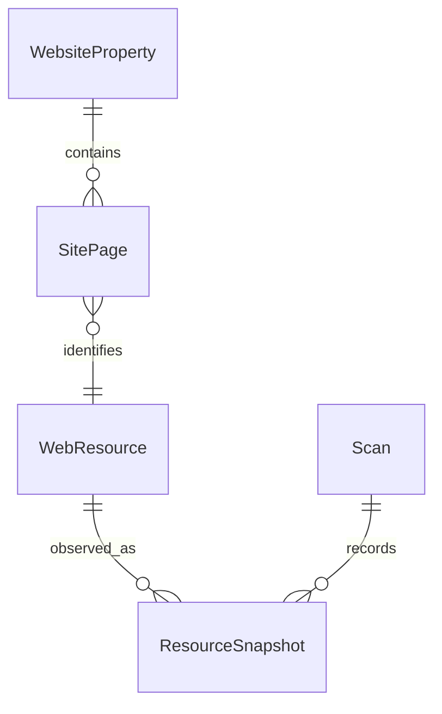
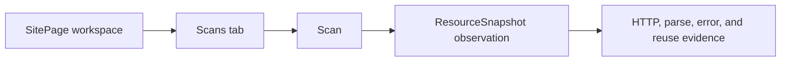
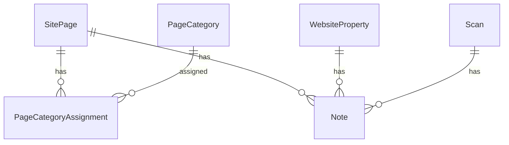
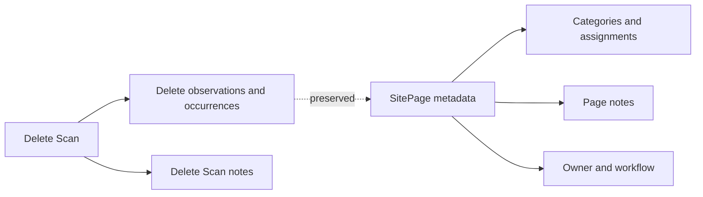
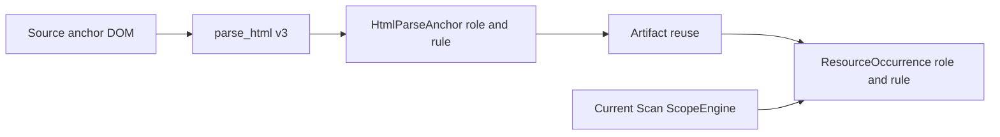

# Site Ledger Page Workspaces

Page workspaces add Site-specific organization and workflow without weakening Site Ledger's
historical evidence model.

## Identity And Association

`WebResource` remains the global versioned identity for one normalized URL. `SitePage` associates that
identity with one saved `WebsiteProperty` and owns manual metadata for that Site. Overlapping Sites
therefore share one `WebResource` while retaining separate categories, notes, owner labels, and
workflow statuses.

Resource-ID deep links resolve an existing direct `WebResource` first and consult an explicit
`WebResourceAlias` only when that legacy ID no longer exists. Grandfathered V1 resources therefore
remain valid Page identities and are never redirected heuristically to a V2 resource.

A `SitePage` is ensured when a saved-site scan creates any observation, including a failed,
skipped, redirected, revalidated, or successful result. Ad hoc scans and source-only Inventory
candidates do not create `SitePage` rows. The migration backfills distinct saved Site and observed
resource pairs using the earliest retained observation time when available.

The snapshot detail response resolves Page workspace context through the observation's own Scan.
It reports the associated Site and matching `SitePage` in one read-only query. Observation views
link to the workspace only for HTML Page evidence with that exact association; overlapping Sites,
ad hoc Scans, missing legacy associations, and non-HTML Resources do not produce inferred links or
create `SitePage` rows during reads.

The Content tab selects the latest successful retained HTML observation for the Site and Page and
shows its versioned structured source outline. The exact Scan observation also has a Content tab.
Historical blobs remain explicitly Not prepared until built, and all extracted text is rendered as
escaped plain text. See [Structured Page Content](structured-page-content.md).

## Workspace

The persistent Page route provides URL-backed Overview, Scans, Links, and Notes tabs. Tabs load
independently.

- Overview separates manual workflow status from the latest observation status.
- Scans lists retained appearances of the Page in Scans, with This Site and All Sites scopes.
- Links always identifies one selected observation and never merges historical link evidence.
- Notes stores plain-text Site-specific context on `SitePage`.

A completed observation is immutable evidence. During the active static phase, bounded transient
retries remain part of the same ResourceSnapshot observation and every StaticFetchAttempt is
retained beneath it. After a Scan completes, the workspace does not offer Page retry, Page rerun,
targeted Page checking, observation replacement, or attachment of new evidence to that old Scan.
Future whole scans can produce later observations.

The Scans tab reports appearances only. A Page not appearing in another Scan is not labeled missing
or removed because scope, limits, cancellation, discovery, and source inputs may differ.

## Organization

Site-specific owner labels are optional trimmed freeform text. They are not user accounts, teams,
contacts, permissions, or notification targets.

Workflow status is explicit manual metadata with stable keys: `unreviewed`, `needs_review`,
`approved`, `updating`, `deprecated`, and `archived`. HTTP results never set workflow status.

Categories are flat and Site-scoped. Names use case-insensitive normalized identity while preserving
display spelling. Colors come from a fixed accessible palette. A Page can have several categories.
Automatic Category Rules add normalized support provenance without replacing the effective
assignment relation. Manual and several Rule supports may coexist, while a Page/Category exclusion
suppresses automatic support only. See [Page Category Rules](page-category-rules.md).
Archiving prevents new assignment and disables active Rules. Existing manual assignments remain;
automatic-only assignments disappear after reconciliation. Deletion removes only organization
metadata, never Pages or notes.

Site Pages support explicit current-page selection and transactionally bounded bulk category,
owner, and workflow changes. Bulk requests accept at most 500 explicit resource IDs. Selecting a
loaded page never implies selecting every filtered result.

SQLite query-plan checks confirmed the composite occurrence source/role index serves outgoing role
filters, the Site/workflow index serves workflow-filtered catalogs, and the assignment Page index
serves category enrichment. The catalog and graph tests also assert bounded SQL query counts as the
number of Pages and occurrences grows.

## Notes

One `Note` table uses explicit nullable foreign keys plus a database check requiring exactly one
target: Site, Scan, or SitePage. Page notes attach to SitePage, never global WebResource. Notes are
trimmed plain text with preserved line breaks, a 20,000-character limit, and pinned-first ordering.
React renders note bodies as escaped text. Markdown, HTML execution, rich text, attachments,
authors, and threaded comments are not supported.

Deleting a Scan deletes its Scan notes but preserves SitePage notes and organization metadata.
Deleting a Site removes its Site notes and SitePage-owned notes. Deleting a snapshot, category,
content blob, or parse artifact does not remove Page notes.

## Link Roles

Link roles classify individual source-DOM occurrences and are unrelated to user-managed Page
categories. The role precedence is:

1. `email`: `mailto:` (`href_mailto`)
2. `telephone`: `tel:` (`href_tel`)
3. `download`: download attribute or recognized final path extension
4. `breadcrumb`: breadcrumb landmark evidence
5. `footer`: footer or contentinfo ancestor
6. `sidebar`: aside or complementary ancestor
7. `main_content`: main ancestor or role
8. `navigation`: nav or navigation ancestor
9. `header_utility`: header or banner ancestor
10. `image`: image-only link without usable visible or accessible text
11. `unknown`: no supported rule

Download extensions are centralized in `crawler.link_roles` and inspect only the resolved path, not
query parameter filenames. Bounded context records landmark tag/role/label, image/text booleans,
download-attribute presence, and resolved extension. It does not retain ancestor DOM or scripts.

Parser version `html-parser-v3-resource-references` retains link roles and adds embedded Resource
references. Existing occurrences remain valid with null roles and display as **Unclassified legacy
link**. A future scan parses or selects a current-version artifact, copies role evidence to new
occurrences, and independently recomputes scope decisions. Historical rows are not mass-reparsed.

Inbound roles describe the occurrence in the source Page's DOM, not the destination Page. Duplicate
occurrences and different roles between the same source and target remain preserved. Graph edge
identity, ranking, limits, and layouts are unchanged; inspectors receive SQL-aggregated role counts
and occurrence role evidence.

## Lifecycle And Limits

Deleting one or all Scans preserves `SitePage`, categories, assignments, Page notes, owner, and
workflow status. A `WebResource` is not orphaned while any SitePage references it. Site deletion
removes Site-scoped metadata and then permits normal reference-aware cleanup.

The Site Resources tab is separate from Pages and URL Inventory. Resources have Scan-derived
history and Used-by-Page provenance but do not inherit Page categories, owner, workflow, or notes.
See [Resource Inventory](resource-inventory.md).

The persistent Page workspace includes deterministic Change History across observed snapshots.
The current workspace intentionally excludes saved views, findings, authenticated ownership,
audit-log history, hierarchical or AI categories, user-defined link-role overrides, rich-text
notes, and targeted Page reruns. Directional Page presence comparison lives in the Site Comparison
workspace; see [Deterministic Scan comparisons](scan-comparisons.md).

Saved views, findings-driven workflow, and authenticated ownership remain future additions rather
than concepts implied by the freeform owner label or category system in this release.
