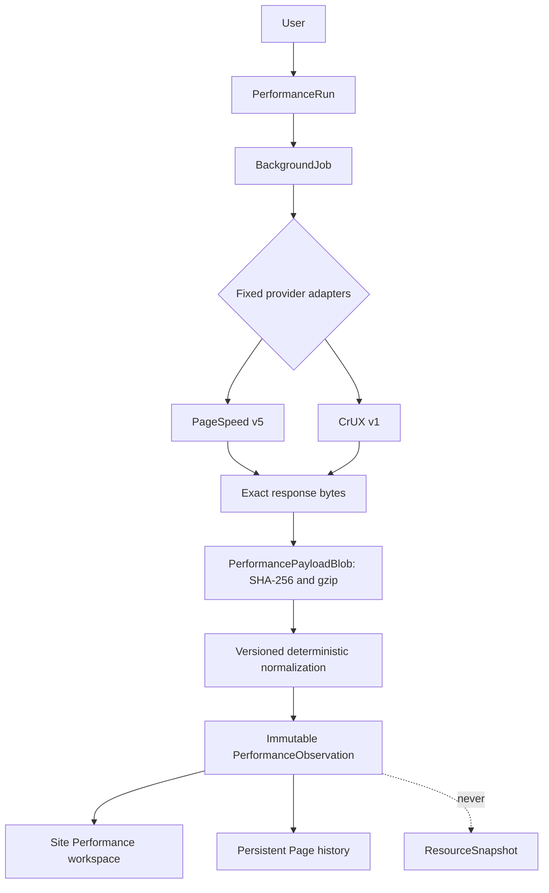

# Performance Observations

Performance is Site Ledger's first external-provider observation domain. It retains what Google
returned, derives a deliberately small versioned summary, and presents the evidence independently
of Site Ledger Scans. Collection is manual and on demand.

## Evidence Ownership

PageSpeed lab evidence and CrUX field evidence remain distinct:

- **PageSpeed Lab** is one synthetic Lighthouse-style run for a URL using `mobile` or `desktop`.
- **CrUX Field** is Google's current aggregated real-user dataset for a URL or Site origin using
  `PHONE` or `DESKTOP`. A legitimate lack of qualifying samples is `unavailable`, not a failure.

Performance observations do not belong to `ResourceSnapshot`, Scan projections, browser capture,
structured content, or Scan Comparison. A URL observation may reference the existing persistent
Page `WebResource`; an origin observation references only its Site and explicit requested origin.
Provider-returned URL normalization is provenance and never rewrites `WebResource` identity.

## Stored Model

`PerformanceRun` stores canonical requested configuration and mutable execution state. It records
Page targets, provider dimensions, deterministic request count, progress counters, lifecycle
timestamps, and a sanitized terminal summary. It never stores metric values.

`PerformanceObservation` is one immutable terminal provider result for one run, target, provider,
and dimension. Logical uniqueness is enforced across those dimensions. Outcomes are `ready`,
`unavailable`, or `failed`. A later run always creates new observations; "latest" is a query over
history and a newer failure is not hidden by an older ready result.

`PerformancePayloadBlob` stores exact response bytes once by SHA-256. Files use deterministic gzip
and retain raw/stored byte sizes and content type. Byte-identical payloads share a blob while their
observations remain separate. The raw evidence route returns plain text; the UI escapes it and
limits rendered characters without changing retained evidence.

## Provider Contracts

The adapters call fixed HTTPS endpoints defined in backend code:

- PageSpeed Insights `v5/runPagespeed`, `category=performance`, strategies `mobile` and `desktop`.
- CrUX `v1/records:queryRecord`, URL or origin, form factors `PHONE` and `DESKTOP`.

Field evidence comes from standalone CrUX, not PageSpeed's embedded field section. The CrUX History
API is not used. Internal versions are `pagespeed-provider-v1`, `crux-provider-v1`, and
`performance-normalization-v1`.

PageSpeed normalization retains performance score, FCP, LCP, CLS, TBT, Speed Index, server response
time, analyzed URL, analysis time, and Lighthouse version when present. CrUX normalization retains
LCP, INP, CLS, FCP, and TTFB p75 plus returned histograms, target, and collection period. Missing
metrics remain missing. Canonical normalized JSON has its own SHA-256 identity.

## Security And Networking

`SITE_LEDGER_GOOGLE_API_KEY` is backend environment configuration. Only a boolean configured state
is exposed. The key is never stored in runs, observations, payload checksums, request descriptors,
logs, or API responses. Provider clients use fixed hosts, HTTPS, explicit timeouts, bounded streamed
response bodies, no redirects, and `trust_env=False`.

Transient network failures, HTTP 429, and selected 5xx responses receive at most three attempts.
`Retry-After` is honored up to five seconds. Deterministic 4xx responses are not repeatedly retried.
Final messages are sanitized; exact HTTP response bodies remain payload evidence when received.

## Jobs And Limits

The `performance_run` BackgroundJob executes requests serially to protect provider quota. The
default selection guidance is 10 Pages and the hard application cap is 25. The API rejects invalid
Site membership, unknown Pages, duplicate targets/dimensions, unsupported dimensions, missing
providers, and oversized selections rather than truncating them.

Cancellation is cooperative between requests and preserves completed observations. Reclaim is
idempotent because each logical request is checked before collection and protected by database
uniqueness. A run with any failed observation ends `completed_with_errors`; CrUX unavailable results
do not produce that status. Expired worker leases settle both the job and run.

## Workspace

`/sites/:siteId/performance` has URL-backed Overview, Lab, Field, and Runs views. The collection
surface uses paginated persistent Page search, explicit selection, provider dimensions, Site-origin
CrUX choice, and an exact provider-request count. Active runs poll until terminal. Nested routes own
run details and raw evidence, and Site switching returns to the destination Site's Performance root.

Persistent Pages have a Performance tab with latest Lab Mobile/Desktop, latest Field Phone/Desktop,
history, and a one-Page run action through the same `PerformanceRun` API.

## Measured Scale

The manual `python -m app.performance_benchmark` fixture creates 5,000 Pages, 50 runs, and 15,000
observations. On the development Windows/SQLite environment, measured query p50/p95 values were:

| Query | p50 | p95 |
| --- | ---: | ---: |
| Latest Site evidence, first 500 | 96.5 ms | 118.4 ms |
| One Page history | 10.2 ms | 13.9 ms |
| Run list | 2.7 ms | 3.6 ms |

Small deterministic fixtures measured 490 raw / 281 gzip bytes for PageSpeed and 373 raw / 243 gzip
bytes for CrUX. Real PageSpeed payloads can be much larger, so collection enforces a 12 MiB default
exact-response limit and stores each payload only once.

## Non-Goals

This domain does not implement Findings, regression classification, baselines, alerts, schedules,
notifications, CrUX History import, charts, AI interpretation, analytics, accessibility, SEO, Best
Practices, crawler changes, or Scan Comparison integration.
