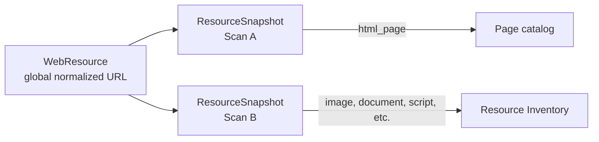
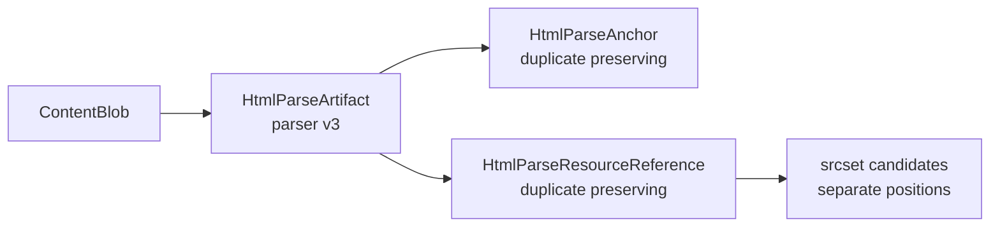
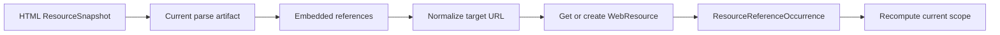
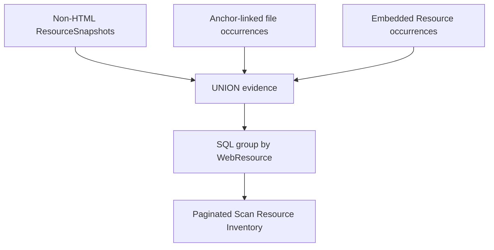
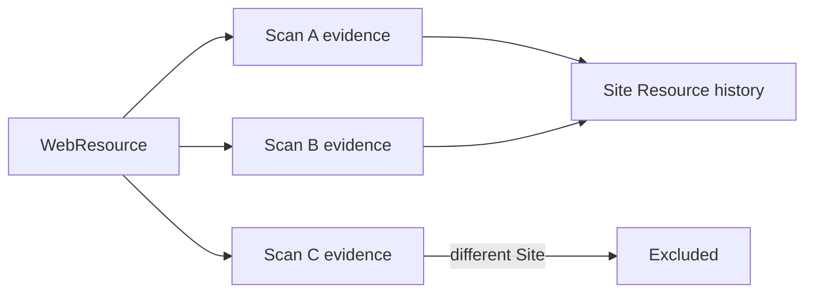
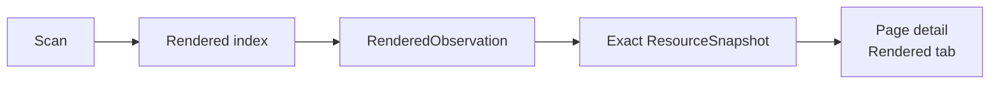

# Resource Inventory

Resource Inventory records non-HTML files that a Scan observed directly or that retained HTML
referenced. It is distinct from the URL-source Inventory: Sources describe candidate inputs, while
Resources describe representation evidence and references found during a Scan.

## Page And Resource Model

`WebResource` remains the global identity for one normalized URL. A URL is not given a second
identity when its observed representation changes. `ResourceSnapshot` records one Scan-specific
static observation and carries the representation classification. Successful HTML observations
belong in Pages; successful non-HTML observations and inferred embedded references belong in
Resources. Legacy `resource_type` values remain compatibility-sensitive and are not used as the
current representation classifier.

Resources are **observed** when a non-HTML `ResourceSnapshot` exists in scope. They are
**discovered only** when an anchor or embedded-reference occurrence exists but no non-HTML static
observation exists in that Scan. An observed classification takes precedence over inferred
reference classification.

## Classification

The stable kinds are `html_page`, `image`, `document`, `stylesheet`, `script`, `font`, `video`,
`audio`, `archive`, `feed`, `manifest`, `structured_data`, `other`, and `unknown`. Every result also
records a rule so the decision is explainable.

Classification precedence is:

1. Normalized response MIME type.
2. A bounded, sanitized Content-Disposition filename extension.
3. A bounded signature prefix when headers are absent or ambiguous.
4. Element context for discovered-only HTML references.
5. The final/request URL extension.
6. `other` when an unrecognized MIME exists, otherwise `unknown`.

MIME is authoritative over a misleading extension. HTML includes `text/html` and
`application/xhtml+xml`. Office MIME types are documents; RSS and Atom are feeds; JSON/XML are
structured data unless a more specific feed or manifest type applies. Signature inspection is
bounded and supports common PDF and image signatures; it is not file validation.

Successful non-HTML HTTP responses are successful Resource observations. They use `fetch_state`
`fetched`, `parse_method` `not_applicable`, and no crawler error. They do not increase
`failed_count`, appear in Errors, create a `SitePage`, or enter Page catalogs.

The migration classifies historical snapshots from retained MIME/header/URL evidence and corrects
successful `unsupported_content_type` rows. It recalculates Scan failure and representation counts.
A `completed_with_errors` Scan becomes `completed` only when no true static or rendered failure
remains. Existing Site Page metadata is untouched.

## Embedded References

The HTML parser extracts references from images and `srcset`, picture sources, scripts, supported
`link` relations, video/audio/source/track, object/embed, and image inputs. Data URLs, script URLs,
fragments, mail, and telephone links are excluded. Relative and protocol-relative references are
resolved against the final Page URL.

Each valid `srcset` candidate is retained separately with its descriptor. Duplicate references are
intentional evidence and remain separate occurrences. Element/attribute, raw and resolved URL,
DOM path, relation, media/type/as hints, alt/title, dimensions, loading, and crossorigin context are
preserved where available.

`HtmlParseArtifact` uses parser version `html-parser-v3-resource-references`. Exact-hash reuse loads
the deterministic parsed references. Current Scan scope is recomputed when references become
Scan-specific occurrences; an old scope decision is never reused.

Anchor-linked file URLs continue to use `ResourceOccurrence`; embedded references use
`ResourceReferenceOccurrence`. Resource Inventory combines both evidence sources without erasing
their provenance.

## Fetch And Storage

Embedded references do not automatically enqueue requests. This avoids turning one Page into
hundreds of new network requests. A non-HTML URL is fetched only when it is otherwise queued, such
as a direct seed or crawlable anchor.

When response headers classify a non-HTML representation, the crawler records headers and declared
length without consuming the body. Ambiguous responses inspect at most a small prefix before
deciding whether to continue an HTML read. Resource bodies are not persisted in `ContentBlob`.
Declared length and transferred/inspected bytes are separate fields.

## Inventory Aggregation

Scan Resources provide summary counts, server-side filters, sorting, pagination, detail, and
Used-by-Page provenance. Site Resources aggregate retained evidence only from Scans attached to the
selected Site and provide a per-Scan history. Overlapping Sites do not share Site evidence merely
because they share a normalized URL.

Summary and table queries use set-based SQL aggregation. Occurrence and source-Page counts are not
loaded per row. The supporting indexes target source snapshot/kind and target resource/source
access paths confirmed by SQLite query plans.

## Rendered Index

The Scan Rendered tab is a discoverability index over existing `RenderedObservation` evidence. It
supports search, capture state, navigation status, warning/error/artifact filters, sorting, and
pagination. Links open the exact static snapshot's Rendered tab. It does not change capture
selection, retry rules, or browser policy.

Rendered DOM and browser-network entries do not feed Resource Inventory. Graph topology also
remains based on Page-link evidence only.

## Deletion And Security

Deleting a Scan removes its `ResourceReferenceOccurrence` rows and representation snapshots.
Parsed references remain only while their parse artifact remains retained under the existing blob
lifecycle. Orphan cleanup preserves a `WebResource` referenced by snapshots, anchors, embedded
references, source entries, Scan seeds, or Site Pages. Resource-body reclamation is never claimed
because Resource bodies are not stored.

Resource URLs, response metadata, and filenames are untrusted text. The UI escapes them and never
executes or embeds remote scripts, styles, fonts, images, PDFs, or media. Content-Disposition
filenames are bounded, stripped of control characters, and never used as filesystem paths. Opening
a live Resource is an explicit user action.

## Current Limits

This implementation does not store Resource bodies, derive image dimensions, hash duplicate files,
extract PDF text or metadata, parse Office/archive contents, parse CSS references, discover
Resources from rendered DOM/network evidence, compare Resources across time, or create Resource
findings. Those are future capabilities and require separate evidence, storage, security, and
retention designs.
