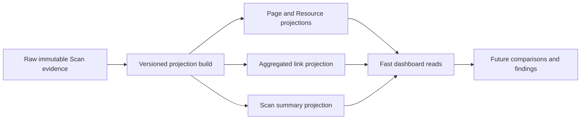
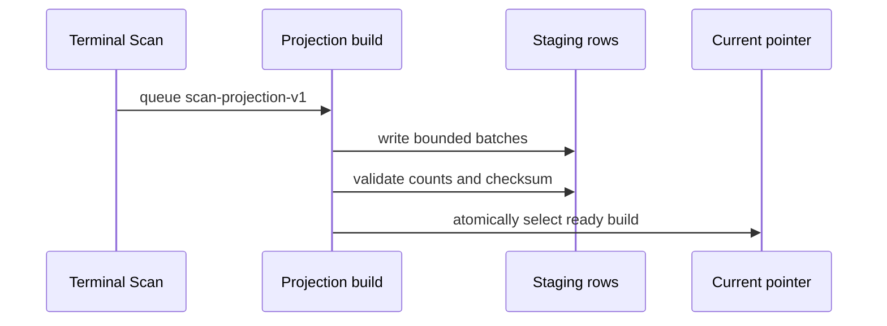
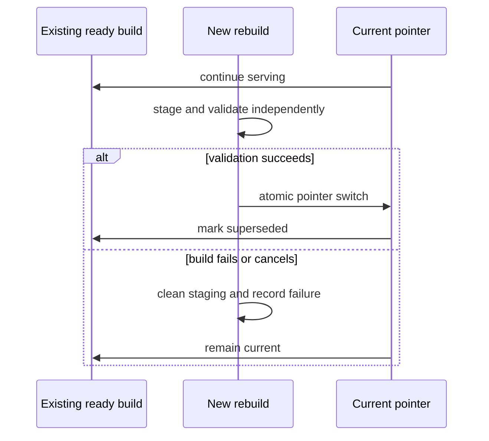
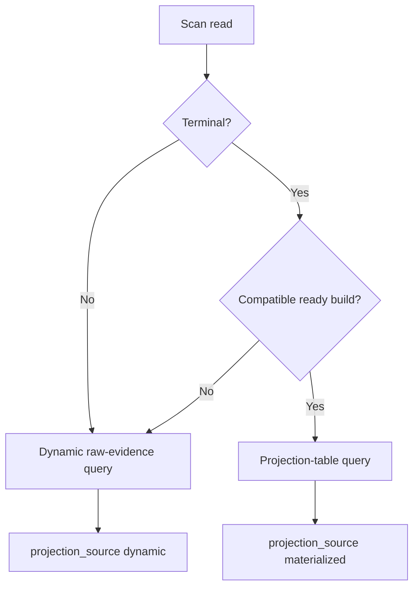
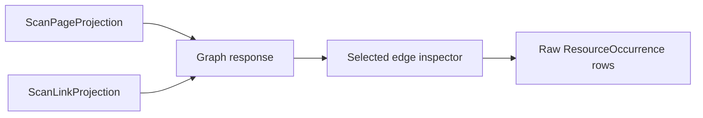
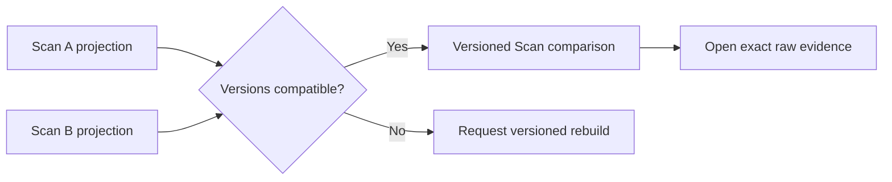
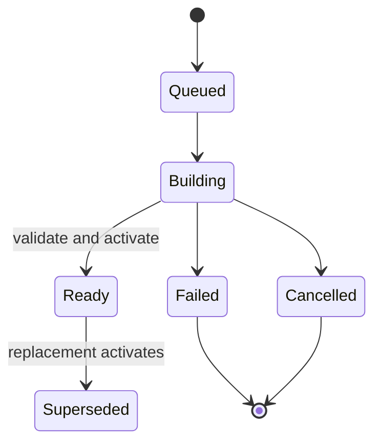

# Scan Projections

Scan projections are deterministic, versioned database indexes derived from one terminal Scan's
immutable evidence. They make repeated Page, Resource, link, summary, and graph reads fast. They
are disposable and rebuildable; the observations, occurrences, stored HTML, browser events,
artifacts, fetch attempts, and redirect evidence remain authoritative.

The current projection version is `scan-projection-v1`. New builds use algorithm identity
`scan-projection-v1:resource-classifier-v1:link-role-v1`, which describes the projection
computation itself. Upstream evidence producers such as the HTML parser retain their own versioned
artifact provenance and are not duplicated in the projection identity.

Ready historical builds stamped with
`scan-projection-v1:html-parser-v3-resource-references:resource-classifier-v1:link-role-v1` remain
compatible and readable. This compatibility does not rewrite or rebuild them; all new builds store
only the decoupled current identity. Unknown identities remain incompatible.

## Evidence Boundary



`ResourceSnapshot`, `ResourceOccurrence`, `ResourceReferenceOccurrence`, stored HTML, parse
artifacts, rendered observations, browser event rows, artifacts, and `StaticFetchAttempt` are never
replaced by projections. Exact Page and Resource detail, occurrence drill-down, browser evidence,
HTML, retries, and redirects continue reading those raw tables.

Terminal statuses are `completed`, `completed_with_errors`, `failed`, `cancelled`, and
`interrupted`. Collection cannot add evidence after these states. Queued, running, and cancelling
Scans always use dynamic queries.

## Tables

- `ScanProjectionBuild` records one attempt, version, algorithm identity, lifecycle, source and
  output counts, duration, validation data, and deterministic checksum.
- `ScanProjectionState` contains the atomic pointer to the current ready build for a Scan.
- `ScanPageProjection` stores one canonical Page row and its inbound/outbound, rendered-summary,
  seed, response, hash, canonical, and graph-node fields. It does not contain HTML.
- `ScanResourceProjection` stores the canonical union of observed non-HTML snapshots, embedded
  references, and file-like anchor references.
- `ScanLinkProjection` stores one directed source-snapshot/target-resource aggregate while raw
  duplicate occurrences remain intact.
- `ScanSummaryProjection` stores frequently displayed totals and bounded grouped counters.

Page projection rows also serve as graph nodes and link projection rows as graph edges. Separate
graph tables would duplicate the same immutable identity and metrics, so no graph-only projection
tables are used.

Mutable `SitePage` categories, owner, workflow status, notes, and other user annotations are never
copied into a Scan projection. Site catalogs may compose ready Scan results with current Site
metadata, but this PR does not create a mutable Site-wide projection subsystem.
Category Rules, assignment supports, automatic exclusions, and Site display timezone are mutable
Site metadata. Their changes neither rebuild projections nor alter projection versions or checksums.

## Build And Activation

A terminal crawl commits its evidence first and then queues a durable `scan_projection_build` job.
Projection failure cannot change the Scan's crawl status. Builds commit rows in bounded batches,
report progress, honor cancellation, validate source and projected counts, calculate a checksum,
and activate only after the complete result is valid.



Only one queued/building build may exist per Scan and projection version. The unique active key and
durable job dedupe key protect this rule. Interrupted or cancelled builds remove their staging rows
and record failure details. A first-build failure leaves the pointer empty, so reads remain dynamic.



Superseded build records remain available for diagnostics and can be garbage-collected only after a
successful replacement. Raw evidence is never garbage-collected by projection maintenance.

## Query Routing



Existing Page, Resource, Resource-summary, and Graph routes are preserved. Their responses expose
projection source, expected version, build ID, and status. Missing or version-incompatible terminal
projections use the existing dynamic implementation as the equivalence oracle and remain usable.
Repeated reads do not queue duplicate jobs.

Projection-backed Page and Resource lists retain search, filters, sorting, pagination, stable ID
tie-breakers, and observation navigation. Resource summaries read `ScanSummaryProjection`.
Projection-backed graph loading reads Page and Link projections, including bounded focus traversal;
edge occurrence inspection remains a paginated raw-evidence query.



Rendered projections contain only availability, state, capture time, and event/artifact counts.
Network entries, console messages, Page errors, screenshots, rendered DOM, and full capture records
remain raw browser evidence.

## HTTP And Frontend Caching

Projection-backed immutable endpoints return `Cache-Control: private, no-cache`, deterministic
ETags keyed by build, version, path, and query, and a `304` for matching validators. Dynamic active
or fallback results do not claim immutable ETag semantics.

TanStack Query uses `staleTime: Infinity`, disables focus and reconnect refetch, and disables
polling only when a terminal Scan has a compatible ready projection. Cached filter/page variants
have a bounded 45-minute `gcTime`. Active Scans retain polling. Terminal dynamic fallback is cached
briefly while projection status polls; when a build becomes ready, query keys are invalidated and
ordinary routes switch to prepared results. Scan deletion removes Scan-related query entries.

The Scan workspace shows a compact Results index state and build/rebuild action. Resources state
that current evidence remains available while optimized results are prepared.

## Historical Scans And Recovery

Alembic creates empty projection tables and performs no heavy backfill. Operators can run:

```powershell
python -m app.scan_projections build <scan_id>
python -m app.scan_projections build-missing --limit 25
python -m app.scan_projections rebuild <scan_id>
python -m app.scan_projections verify <scan_id>
```

`build-missing` continues after an individual failure by default; `--stop-on-error` changes that
behavior. A version mismatch preserves old rows for diagnosis, routes normal reads dynamically, and
allows a current-version rebuild. Verification checks stored/source counts and reports the build
checksum.

Scan deletion explicitly removes projection rows, state, and builds before normal evidence cleanup.
It does not alter shared blob, WebResource, SitePage, AI Document Source, or other Scan semantics.

## Performance

The deterministic `python -m app.scan_projection_benchmark` fixture contains 2,000 Pages and 18,000
duplicate-preserving references/links. On the PR #16 Windows/SQLite validation machine:

| Operation | Dynamic cold | Projected cold | SQL statements |
| --- | ---: | ---: | ---: |
| Page first page | 24.69 ms | 10.39 ms | 3 projected |
| Resource first page | 229.35 ms | 5.37 ms | 3 projected |
| Resource summary | 206.69 ms | 1.82 ms | 2 projected |
| Bounded graph | 136.21 ms | 111.71 ms | 7 projected |

Resource first-page speedup was 42.71x. Initial build took 1,485.09 ms; rebuild took 1,408.08 ms.
The projection added 2,199,552 bytes for 2,000 Page, 2,006 Resource, and 2,000 Link rows, or 0.0143
SQL statements per projected row during the batched build. `EXPLAIN QUERY PLAN` selected
`ix_projection_resource_build_url`. All measured Page, Resource, summary, and graph outputs were
equivalent, and deleting projections left 2,000 snapshots and all 18,000 raw occurrences intact.
Timings are diagnostics, not CI budgets.

## Comparison Compatibility



Comparison aligns normalized URL, snapshot/resource identity, content/head hashes, HTTP
and fetch state, redirects, canonical/indexability fields, link identity, Resource classification,
and rendered availability. It must compare compatible projection versions or request rebuilds, and
must open raw evidence for detailed changes. See
[Deterministic Scan comparisons](scan-comparisons.md).

## Limitations

- Projection creation is intentionally a one-time expensive operation.
- Site-level mutable catalogs are not broadly materialized.
- Superseded build rows are retained until explicit future garbage collection.
- Full graph layout and camera state are not projected.
- Exact evidence queries can still be expensive by design and remain paginated.


