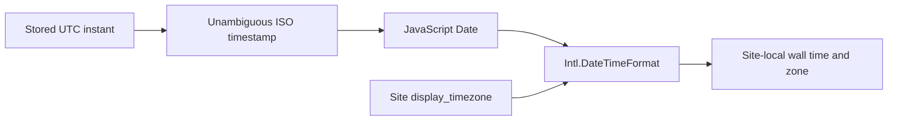

# Site Display Timezones

`WebsiteProperty.display_timezone` is optional presentation configuration. A null value means use
the viewer browser's local timezone. Saved values are validated IANA identifiers such as
`America/New_York`; fixed abbreviations and offsets are rejected.

All persisted timestamps represent absolute instants, preferably UTC. SQLite can return naive
datetime values even for timezone-declared columns, so the shared `UTCDateTime` ORM type restores
UTC tzinfo for legacy and current rows before Pydantic serialization. The API therefore emits a
`Z` or `+00:00` offset. The frontend also treats legacy timezone-less API values as UTC at its
shared parsing boundary.

Site create forms preselect `Intl.DateTimeFormat().resolvedOptions().timeZone` when available and
offer the environment's full `Intl.supportedValuesOf("timeZone")` list. Clearing the field restores
browser-local behavior. IANA data handles DST, so `America/New_York` displays EDT in summer and EST
in winter without storing a fixed offset.

Absolute timestamps in a Site workspace and a Scan owned by that Site use the Site timezone.
Global mixed-Site screens and ad-hoc Scans use browser-local time. Relative labels remain elapsed
duration calculations. Changing the preference rerenders presentation only: it does not rewrite
evidence, rerun Category Rules, rebuild projections, change hashes, or alter projection checksums.

Display timezone is not scheduling configuration. A future scheduling feature must define its own
timezone semantics explicitly, even if it offers the Site display timezone as a default.
