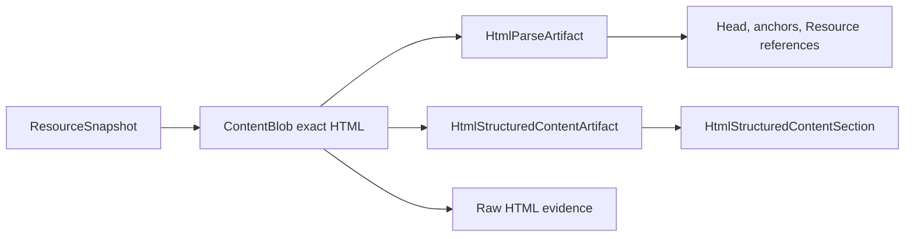
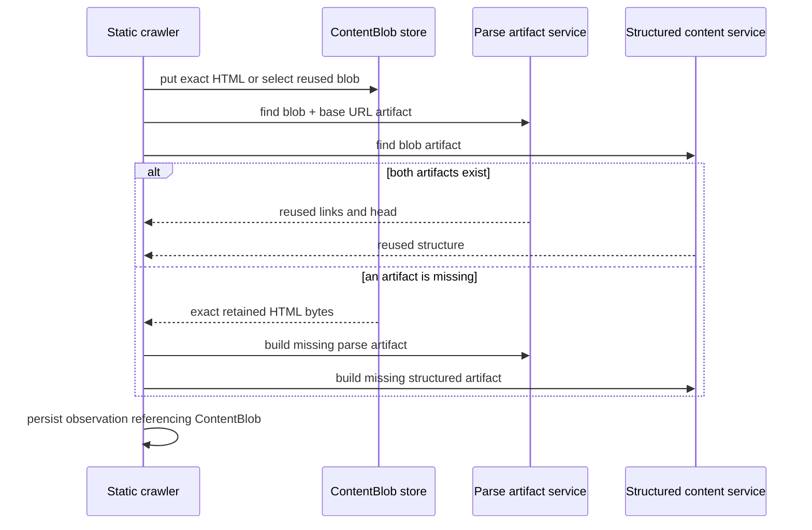
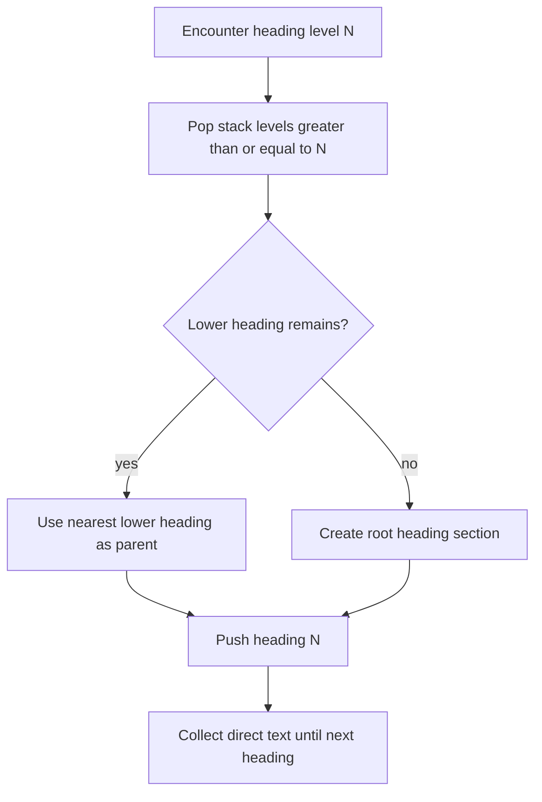
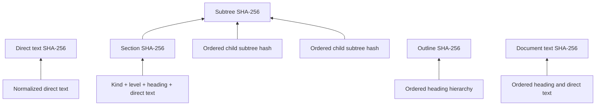
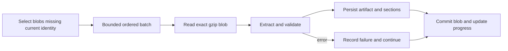
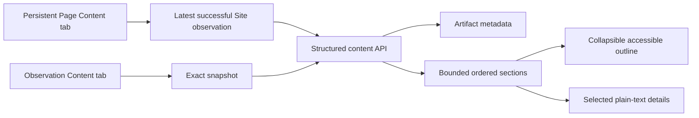

# Structured Page Content

Structured Page Content is deterministic, source-derived Page evidence. It records the heading
outline and direct text sections of retained static HTML without replacing exact HTML, resolving
links, executing JavaScript, or changing comparison semantics.

The current identity is `structured-content-v1 | default-v1 | ContentBlob`. It is intentionally
independent from `html-parser-v4-rel-token-semantics`, `document-content-v2`,
`scan-comparison-v3`, and `scan-projection-v2`.

## Ownership And Identity

One compatible artifact belongs to one exact `ContentBlob`. The artifact is shared by every
observation that references that blob, including observations with different base URLs. Link
resolution remains in the base-URL-specific `HtmlParseArtifact`.



Artifact identity is `(content_blob_id, extractor_version, extractor_config_version)`. The blob
foreign key uses `ON DELETE CASCADE`; sections cascade from their artifact. Scan deletion keeps a
shared blob and all derivatives while another observation references it. Deleting an exclusive
blob removes its derivatives. Rebuild changes only compatible structured rows and never changes
raw HTML, parse artifacts, projections, or comparisons.

## Crawl And Reuse Lifecycle

Fresh HTML is stored by exact SHA-256, parsed for head/link evidence, and prepared as structured
content. Conditional 304 handling checks both artifact identities before reading compressed HTML,
so complete exact reuse requires no decompression or parse.



Structured reuse does not reinterpret existing Scan parse counters. Those counters continue to
describe the established head/link parser.

## Extraction Semantics

The extractor uses lxml recovery parsing over static source HTML. It excludes `head`, `script`,
`style`, `template`, `svg`, and `noscript`. It does not apply CSS, execute JavaScript, inject image
alt text, infer visibility from classes, or resolve anchor destinations. Anchor text and readable
table text remain content. Table cells use tab separators and rows use line separators.

Text whitespace is normalized deterministically. Character counts are Unicode code-point counts.
Word counts are non-empty Unicode whitespace-delimited tokens, not NLP tokens. The nearest
semantic ancestor labels a section `main`, `article`, `nav`, `header`, `footer`, `aside`, `body`,
or `unknown`; classes and IDs do not affect region classification.

Heading processing preserves every source `h1` through `h6`, including empty and duplicate
headings, multiple `h1` elements, and skipped levels. For level N, prior stack entries with level
greater than or equal to N are popped; the nearest remaining lower-level heading is the parent. No
synthetic heading is inserted.



Meaningful text before the first heading becomes `preamble`. A meaningful document with no
headings becomes one `unheaded` section. Empty documents have no sections. Direct text belongs to
the most recently encountered heading only until the next heading of any level; descendant text is
not copied into ancestors.

CSS-like DOM paths use lower-case names and add `:nth-of-type(n)` only where same-tag siblings need
disambiguation. Paths are provenance, not semantic identity.

## Hashes And Counts

All hashes use SHA-256 over UTF-8. Canonical structured values use compact, key-sorted JSON.

- `direct_text_sha256` hashes normalized direct text.
- `section_sha256` hashes kind, heading level, heading text, and direct text. It excludes database
  IDs, parent IDs, timestamps, DOM paths, regions, and positions.
- `subtree_sha256` hashes the section hash followed by ordered child subtree hashes.
- `outline_sha256` hashes ordered kind, level, heading text, and hierarchy without body text.
- `document_text_sha256` hashes the ordered heading/direct-text representation. It is not
  `document-content-v2`.



Before persistence, validation recomputes positions, hierarchy, direct and section hashes, subtree
hashes, child and descendant counts, word and character counts, heading counts, document hash, and
outline hash. Invalid evidence is rejected rather than marked ready.

## Bounds And Failure States

The default maximum is 10,000 total sections and 2,000,000 extracted source characters. Reaching a
bound produces `partial`, sets `is_truncated`, and records `section_limit` or `character_limit`.
Unrecoverable parsing produces `unavailable`. Raw HTML remains authoritative in every state. These
bounds control retained rows and text, not the crawler's earlier network response-size limit.

## Historical Preparation

Migration `202608070020` performs no backfill. Historical blobs show `not_prepared` until prepared.
A single Page or observation can prepare its blob from the Content tab. Larger Site work uses a
durable, site-scoped `structured_content_build` job with progress, cancellation, bounded selection,
and per-blob error continuation.



Run from `backend`:

```powershell
python -m app.structured_content build-missing --site-id 1 --limit 500
python -m app.structured_content build-missing --scan-id 10 --stop-on-error
python -m app.structured_content build 123
python -m app.structured_content rebuild 123
python -m app.structured_content verify 123
```

`build-missing` accepts Site and Scan filters and continues after individual blob failures by
default. `rebuild` replaces only the current structured identity. `verify` checks persisted shape
and ownership.

## API And UI

Exact observations use `/api/snapshots/{snapshot_id}/structured-content`. Persistent Pages use
`/api/sites/{site_id}/pages/{resource_id}/structured-content` and select the latest successful
retained HTML observation for that Site and Page. Matching `/prepare` POST endpoints prepare one
blob. `/api/sites/{site_id}/structured-content/prepare` queues bulk preparation.

Section reads are bounded and paginated with ordered flat rows and parent IDs. Responses include
Scan, observation, blob, fetch, reuse, extractor, and artifact provenance. Absence is explicit as
`not_prepared` or `not_applicable`.



The UI displays strings through React text rendering. Direct text is escaped, pre-wrapped plain
text; retained HTML is never executed. Empty headings are labeled, and preamble and unheaded
sections are distinct. This release adds no section history/comparison, search index, embeddings,
RAG, AI summary, or generated interpretation.

## Operational Boundaries

Structured content does not feed `scan-comparison-v3`, `document-content-v2`, or
`scan-projection-v2`. It is an additional deterministic derivative of exact HTML. Existing source
comparison normalization, exact evidence, projections, and checksums are unchanged.

## Performance Benchmark

Run `python -m app.structured_content_benchmark`. The default fixture creates 2,000 observations,
1,500 unique blobs, and 500 exact reuses across headed, unheaded, deep, table-heavy, and
navigation/footer shapes. It reports extraction, persistence, exact-reuse, API-query latency,
database and compressed-storage growth, peak memory, and deterministic rebuild equivalence.

Local targets are a full fixture under 60 seconds, exact-reuse p95 under 20 ms, API-query p95 under
100 ms, peak traced memory under 512 MiB, and database size under 250 MiB. These are engineering
guardrails, not production service-level guarantees.
