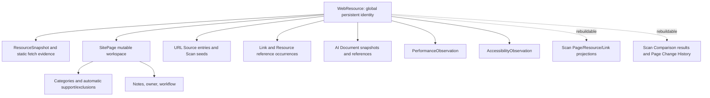

# URL Identity Contract

## Why Identity Matters

`WebResource` is Site Ledger's persistent, cross-Site URL identity. Immutable observations,
Site-scoped Page workspaces, links, external Performance and Accessibility evidence, and rebuildable
Scan derivatives all refer to it. URL normalization is therefore a compatibility boundary, not a
display cleanup. A false equivalence can combine evidence and human metadata from semantically
different resources; changing the key later can require a split rather than a simple string update.

The production contract is explicitly named `url-normalization-v1`. Naming it does not endorse
every transformation and does not change existing output.

## Current V1 Algorithm

Production `normalize_url` performs these steps:

1. Trim the input and resolve it against an optional base with `urljoin`.
2. Require an absolute HTTP or HTTPS URL.
3. Lowercase the scheme; IDNA-encode and lowercase the hostname.
4. Remove HTTP port 80 and HTTPS port 443; preserve other ports.
5. Percent-decode the entire path, run POSIX `normpath`, restore an input trailing slash, then
   percent-encode the result with a fixed safe-character set.
6. Parse the query with form semantics and blank values enabled, drop configured parameters, sort
   all surviving `(key, value)` pairs, and serialize with `urlencode`.
7. Remove the fragment.
8. Rebuild authority from host and port, which silently discards userinfo.

V1 rejects unsupported schemes, missing/invalid hosts, and IPv6 literals. It accepts IPv4 and
retains a trailing DNS dot. Path case and `/page` versus `/page/` remain distinct. Unicode and
punycode host spellings converge through IDNA.

## Questionable V1 Transformations

V1 decodes reserved path octets before determining path structure. Consequently `/a%2Fb` and
`/a/b` become the same identity, encoded dot octets can become structural dot segments, and
repeated literal slashes collapse. V1 also converts encoded semicolon, colon, and at-sign octets to
literal reserved characters. These transformations can create false equivalence because reserved
characters may be producer-defined delimiters.

Query parsing loses distinctions before persistence:

- component order and repeated-value order are sorted;
- key-only `?a` and blank `?a=` become the same pair;
- empty components are removed;
- `+` and `%20` both become a form-space and serialize as `+`;
- percent-encoded and literal forms are decoded and re-encoded;
- surviving parameters are rewritten even when only an unrelated parameter was dropped.

These are observed V1 facts, not a conclusion that every affected URL is semantically distinct.

## Standards Boundary

[RFC 3986 sections 2.1 through 2.3](https://www.rfc-editor.org/rfc/rfc3986.html#section-2.1)
distinguish reserved delimiters from unreserved characters. Percent escapes for unreserved octets
may be normalized; replacing a percent-encoded reserved character with its literal character can
change interpretation. Sections
[5.2.4](https://www.rfc-editor.org/rfc/rfc3986.html#section-5.2.4) and
[6.2](https://www.rfc-editor.org/rfc/rfc3986.html#section-6.2) define literal dot-segment removal and
comparison guidance. The [WHATWG URL Standard](https://url.spec.whatwg.org/) separately documents
the `application/x-www-form-urlencoded` space-as-plus behavior used by V1 query parsing. Form
serialization is not proof that an arbitrary HTTP query's ordering and spelling are irrelevant.

## Site-Specific Query Suppression

`drop_query_parameters` is copied into Site and Scan scope. Matching is case-sensitive and supports
exact keys plus prefix wildcards whose configuration ends in `*`. Dropping occurs after form-style
query parsing. V1 then sorts and re-encodes all survivors.

Source entries and seed origins can retain raw spellings, but the resulting `WebResource` is global
across Sites. Two Sites can therefore apply different suppression policies while competing for one
global normalized identity. A future contract must keep policy suppression distinct from generic
URI syntax and explicitly retain which parameters were suppressed. Existing provenance does not
always recover an overwritten Source spelling or a spelling that reached only a normalized queue.

## Redirect Identity

A `ResourceSnapshot` belongs to the WebResource selected from the requested normalized URL. It
retains `requested_url`, `final_url`, and redirect-chain evidence. A redirect does not automatically
re-key or merge the requested WebResource, and the final URL receives another WebResource only if
normal discovery/source processing creates it. Two requested identities may therefore converge on
one final representation while remaining distinct. Equivalence must come from observation evidence,
not a generic trailing-slash or redirect assumption.

## Dependency Graph



Snapshots, fetch attempts, retained content, parse/rendered evidence, occurrences, AI snapshots,
and external observations are immutable evidence. Projections and Comparisons are rebuildable
derivatives. SitePage owner/workflow, categories, exclusions, and notes are mutable human workspace
state. During a split, requested/resolved URL provenance can often assign immutable evidence and
relationships mechanically. Existing human state generally cannot say which new Page was intended.

## Candidate V2 Principles

`tools/url_identity_audit.py` contains an analysis-only conservative reference. It is not imported
by production runtime. Its principles are:

- lowercase scheme and IDNA hostname, remove only the scheme's default port, and remove fragment;
- uppercase percent-escape hex and decode unreserved octets, while retaining encoded dots until
  literal path structure has been evaluated;
- preserve encoded reserved delimiters, repeated slashes, path case, trailing slash, and
  non-default ports;
- remove literal dot segments under RFC 3986 without first decoding encoded dots;
- preserve query component order, repeated-value order, key-only versus blank, empty components,
  plus versus percent-space, and reserved escapes;
- apply configured drops deterministically without sorting or rewriting surviving components;
- reject credential-bearing candidate identities instead of silently discarding userinfo.

The candidate deliberately favors separate identity when server semantics are unknown. It is a
migration-analysis hypothesis, not a production promise.

## Audit Method

Run the redacted, read-only audit from the repository root:

```powershell
backend\.venv\Scripts\python.exe tools\url_identity_audit.py --database data\scanner.db
```

The equivalent locked-environment command is
`uv run --project backend --extra dev --locked python tools/url_identity_audit.py`. Output uses
SHA-256 URL labels by default. `--show-urls` is an explicit local-only diagnostic and must not be
committed. The connection uses SQLite URI `mode=ro` and `PRAGMA query_only=ON`.

The auditor considers attributable requested/resolved spellings from snapshots, Sources, seeds,
links/references, AI documents, Performance, and Accessibility. Final/provider URLs are counted as
provenance but do not redefine identity. It emits these mutually exclusive resource classes:

- `unchanged`
- `re_key_only`
- `current_over_collapse_candidate`
- `candidate_v2_merge`
- `insufficient_provenance`

Fail-closed migration severities are `SAFE_TO_REKEY`, `SPLIT_MECHANICALLY_RECOVERABLE`,
`SPLIT_WITH_AMBIGUOUS_WORKSPACE_STATE`, `CANDIDATE_MERGE_REQUIRES_REVIEW`, and
`INSUFFICIENT_PROVENANCE`. An audit completing without an exception is never itself approval.

## Retained-Data Baseline

The 2026-08-13 local read-only run measured 1 Site, 25,209 WebResources, 2,417 SitePages, 4,718
ResourceSnapshots, 1,227 Source entries, 2,454 Scan seeds, 825,817 link occurrences, 513,856
Resource-reference occurrences, 42 Performance observations, and 20 Accessibility observations.
No customer URL inventory is committed.

Results were 23,247 unchanged, 1,631 re-key-only, 22 possible current over-collapses, zero
candidate-v2 merges, and 309 insufficient-provenance identities. The 22 candidates represented 44
candidate identities: 13 query-order groups, 6 reserved-query-encoding groups, 2 plus/space groups,
2 repeated-slash groups, and 1 trailing-slash/literal-dot-related group; categories can overlap.
There was no actual encoded-slash collision group and no encoded-dot case, despite four distinct
encoded-slash path spellings occurring in retained evidence. The result is
`SPLIT_WITH_AMBIGUOUS_WORKSPACE_STATE`: 22 SitePages, 20 category assignments, and 22 workflow/note
records require explicit reconciliation if those candidate splits are accepted. Those category
assignments also carry 39 support-provenance rows; there are no affected exclusions or notes.

Mechanically attributable affected data includes 44 snapshots, 4 Scan seeds, 2 Source entries, and
14,698 link or reference rows. Affected rebuildable data includes 7,517 projection rows and 3,759
comparison rows.
No affected Performance or Accessibility observation was found. The synthetic benchmark of 5,000
WebResources and 50,000 evidence rows completed in 1.278 seconds, then 1.005 seconds, with identical
aggregate output; elapsed time is informational and not a CI gate.

## Future Migration Phases

1. Freeze and name V1 semantics.
2. Introduce reviewed V2 code behind an explicit compatibility boundary.
3. Compute candidates from every retained provenance field without mutation.
4. Classify unchanged, re-key, split, merge, and ambiguous identities.
5. Abort automation for candidate merges, insufficient evidence, or ambiguous workspace splits.
6. Create resources and reassign only mechanically attributable immutable evidence.
7. Reconcile mutable SitePage/workflow state explicitly.
8. Rebuild affected projections and comparisons under versioned provenance.
9. Verify foreign keys, evidence counts, and deterministic checksums.
10. Only then make V2 the default for new observations.

Any semantic change requires `url-normalization-v2`. A future design should decide whether the
version belongs on WebResource creation provenance, each Scan's copied scope, parser/source
artifacts, and projection/comparison algorithm identities. Migration provenance needs its own
version. These persistence decisions are intentionally not implemented here.

## Non-Goals

This contract does not change production normalization, re-key/split/merge any WebResource, add a
migration, rewrite evidence, alter Scan projection/comparison versions, change parser semantics,
or add product UI. It does not infer equivalence from redirects, suppress WordPress or unknown
query values, or address Performance/Accessibility UX.
