# URL Identity Migration

## State Boundary

Alembic revision `202608140023` prepares versioned identity after `202608130022`. Existing
populated databases backfill WebResources and Scans as `url-normalization-v1`, set
`reconciliation_required`, and continue creating V1 identities. Fresh empty databases activate
`url-normalization-v2`. Applying schema is not identity migration.

`UrlIdentityState` is the database authority. `UrlIdentityMigration` records compact checksums,
versions, counts, backup metadata, and pre/post fingerprints. Mapping rows preserve old/new resource
attribution. `WebResourceAlias` represents only explicit retired-ID continuity; direct IDs win.

```mermaid
flowchart LR
    U[Schema upgrade] --> V[V1 active on populated DB]
    V --> R[Resolve and rebase manifest]
    R --> P[Preflight: no jobs or workers]
    P --> B[Verified online SQLite backup]
    B --> S[Same-engine disposable simulation]
    S --> A[Explicit apply confirmation]
    A --> T[Transactional reassignment]
    T --> D[Rebuild projections and comparisons]
    D --> I[Integrity and invariant verification]
    I --> X[V2 active]
```



## Commands

Run from the repository root. Full manifests contain private URL inventory and belong only under
the ignored `.local/url-identity/` directory.

```powershell
uv run --project backend --extra dev --locked python tools/url_identity_migrate.py `
  --database data/scanner.db status

uv run --project backend --extra dev --locked python tools/url_identity_migrate.py `
  --database data/scanner.db rebase .local/url-identity/manifest-full.json `
  --output .local/url-identity/manifest-rebased.json

uv run --project backend --extra dev --locked python tools/url_identity_migrate.py `
  --database data/scanner.db preflight .local/url-identity/manifest-rebased.json `
  --backup .local/url-identity/preflight-backup.db

uv run --project backend --extra dev --locked python tools/url_identity_migrate.py `
  --database data/scanner.db simulate .local/url-identity/manifest-rebased.json `
  --destination .local/url-identity/simulation.db `
  --report .local/url-identity/simulation.json
```

Live apply additionally requires `--backup` and the exact phrase
`--confirm "APPLY URL IDENTITY V2"`. It is not authorized by ordinary schema upgrade, simulation,
or merge of this PR. Rollback requires the exact phrase `ROLLBACK URL IDENTITY V2`, the active
migration ID, its verified backup, stopped workers, no jobs, and an unchanged post-migration domain
fingerprint.

## Safety And Ordering

Preflight requires the expected Alembic head, V1 active state, a full current manifest with all
decisions resolved, no candidate merges, no queued/running/cancelling jobs, no healthy workers, and
no preexisting V2 rows. Rebase carries decisions only when the deterministic group and workspace
semantics are unchanged.

Backup uses SQLite's online backup API, then opens the copy and runs integrity and foreign-key
checks. Metadata includes a logical source fingerprint and inventory hashes/counts for HTML,
rendered, Performance, Accessibility, and AI-document stores. Exact evidence bytes are never
rewritten.

The same executor powers simulation and apply. It uses temporary unique keys, preserves IDs for
unchanged/rekey/primary/grandfathered rows, creates secondary split IDs, applies only manifest
attribution, re-evaluates Category Rules, and verifies evidence invariants. Runtime remains V1 while
affected projections and comparisons rebuild. V2 activates only after rebuild and final database
verification. Apply restores the verified backup if any phase fails.

## Interrupted Migration Recovery

Core identity reconciliation and derivative rebuilding intentionally span committed phases because
the rebuild subprocesses need to read the committed database. After core reconciliation commits,
the active migration is `rebuilding` while the recorded active normalization version is still V1.
An abrupt process or machine interruption in that window places the application in fail-closed URL
identity maintenance mode; it does not make V1 safe for continued operation.

During maintenance, runtime identity creation raises `UrlIdentityMaintenanceRequired`, all normal
product API reads and mutations return HTTP 503, and workers leave queued jobs unclaimed. The
`/api/health` diagnostic remains available and reports the active version, migration ID, and
migration status. The migration CLI `status` and explicit recovery/rollback paths remain available.
Missing migration provenance, unknown active statuses, and inconsistent version/status/state
combinations are maintenance conditions and are never repaired by guessing.

Normal caught migration failures continue to restore the verified backup automatically. After an
abrupt interruption, stop product processes, inspect `status`, and use the supported recovery or
verified rollback procedure. Once the database returns to a healthy pre-migration V1 state or a
verified completed V2 state, API operation, identity creation, and worker claims resume.

Immediate rollback is intentionally narrow. Any post-migration domain write changes the stored
fingerprint and causes automatic rollback refusal; recovery then requires an operator-managed plan.
Page Change History remains derived from rebuilt `scan-projection-v1` and `scan-comparison-v2`
evidence. No comparison, parser, structured-content, browser, Performance, or Accessibility version
changes in this migration.
