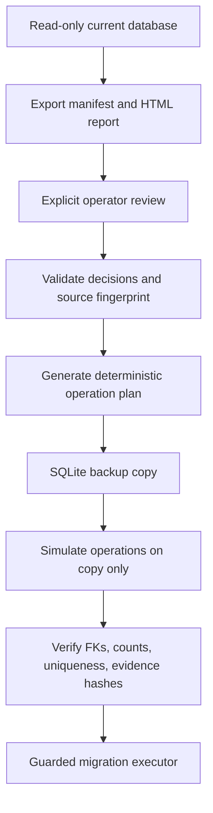

# URL Identity Reconciliation

## Purpose And Boundary

The read-only audit found 1,631 one-to-one candidate rekeys and 22 current V1 identities that could
become 44 candidate V2 identities. Every split has mutable `SitePage` state, so an automatic
migration would have to invent which Page owns human metadata. Another 309 query identities have no
attributable original spelling. They are unknown history, not known corruption.

`tools/url_identity_reconcile.py` turns that evidence into a local, reviewable workflow. Its schema
remains `url-identity-reconciliation-v1`. Production V2 now uses the exact audited candidate
semantics, but reconciliation still does not mutate the retained database and remains separate from
the guarded `url-identity-migration-v1` executor.



## Local Commands

Run these from the repository root. The existing backend virtual environment can equivalently run
`backend\.venv\Scripts\python.exe`.

```powershell
uv run --project backend --extra dev --locked python tools/url_identity_reconcile.py export `
  --output .local/url-identity/manifest-redacted.json

uv run --project backend --extra dev --locked python tools/url_identity_reconcile.py export `
  --show-urls --output .local/url-identity/manifest-full.json `
  --report .local/url-identity/review-full.html

uv run --project backend --extra dev --locked python tools/url_identity_reconcile.py review `
  .local/url-identity/manifest-full.json

uv run --project backend --extra dev --locked python tools/url_identity_reconcile.py validate `
  .local/url-identity/manifest-full.json

uv run --project backend --extra dev --locked python tools/url_identity_reconcile.py plan `
  .local/url-identity/manifest-full.json --output .local/url-identity/plan.json

uv run --project backend --extra dev --locked python tools/url_identity_reconcile.py simulate `
  .local/url-identity/manifest-full.json --report .local/url-identity/simulation.json
```

`.local/url-identity/` is narrowly ignored. Default export replaces URLs with `sha256:` labels.
`--show-urls` is required for human review, planning, and simulation because migration cannot operate
on hashes. Full manifests/reports contain sensitive URL inventory and must never be committed.

## Manifest Identity And Staleness

A group ID hashes the current normalized identity, sorted candidate identities, and applicable Site
IDs. A candidate ID hashes resource type plus candidate URL. Neither depends only on a row ID or
display order.

The source fingerprint includes Alembic head, normalization/candidate versions, identity-bearing row
counts, and a deterministic hash of WebResources, attributable relationships, SitePages,
categories/supports/exclusions, notes, and Category Rules. Validation detects a changed SitePage,
category, evidence row, split population, candidate merge, or version. The manifest checksum covers
the source fingerprint, groups, candidates, decisions, and insufficient-provenance policies, while
excluding generation time, paths, and HTML.

Statuses are `UNRESOLVED`, `PARTIALLY_RESOLVED`, and `READY_FOR_SIMULATION`. Simulation ends as
`SIMULATION_PASSED` or `SIMULATION_FAILED`; PR #29 never claims production readiness.

## Human Decision Boundary

One-to-one rekeys preserve existing WebResource/SitePage IDs and need no human decision. Candidate
merges fail closed. A split requires an explicit primary candidate for old resource-ID continuity
plus field-level decisions:

- `ASSIGN` sends owner, workflow, category, exclusion, or note state to one candidate.
- `DUPLICATE` copies selected state to explicitly named candidates.
- `RESET` applies product defaults and is not valid for notes.
- `UNRESOLVED` records that no decision has been made.

Notes are human intent and are never automatically duplicated. Optional decision notes preserve
rationale. Terminal review saves each answer atomically, permits skip, and preserves prior saves on
interruption. Category Rule suggestions remain suggestions until explicitly accepted.

## Immutable Attribution

Requested identity provenance owns snapshots, seeds, source entries, URL-level Performance,
URL-level Accessibility, and AI document snapshots. Resolved provenance owns link/resource-reference
targets and AI references. An occurrence's source follows its source snapshot. `final_url`, redirect
chains, provider targets, and Accessibility final URLs remain evidence and do not define ownership.
Origin Performance observations are not Page identities.

Every planned reassignment records domain, row ID, current resource, candidate, attribution field,
rule, and deterministic confidence. Full split attribution is exhaustive. Link source and target can
both change through source-snapshot and target attribution respectively.

`HtmlParseArtifact` remains a derivative of content blob, parser versions/configuration, and exact
`resolution_base_url`; identity reassignment alone does not invalidate it. Structured Content is
content-blob scoped and unchanged. Exact content, rendered, Performance, and Accessibility payload
bytes/hashes are never rewritten.

## Workspace And Categories

Owner/workflow are reset on new candidate SitePages and applied only from the manifest. Explicit
manual category support follows the operator decision. Historical rule support is not duplicated.
After final candidate URLs exist, active Category Rules are re-evaluated for every resulting
SitePage, respecting exclusions, and automatic support is rebuilt. Differences are reconciliation
outcomes, not automatically errors.

The current 22-group package has no owner labels, non-default workflows, exclusions, or notes. It
has 20 category assignments and 39 supports. No current group has a single rule-derived suggestion.
These are aggregate facts only; local full URLs stay ignored.

## Insufficient Provenance

All 309 retained cases are query identities without an attributable original spelling. The default
policy is `GRANDFATHER_V1`: retain the historical resource as explicitly legacy V1 and let future
exact V2 observations create new identities. `SAFE_ONE_TO_ONE_REKEY` applies only when retained
evidence proves one candidate and cannot conceal a split. `REQUIRE_REVIEW` applies when alternatives
exist but historical rows cannot be attributed. Never construct an original URL not retained.

PR #30 persists a compact migration record containing source/target versions, manifest
checksum, timing/counts, and old-to-new mappings. A legacy normalization marker plus resource
alias/retirement mapping should represent grandfathering and deep links without claiming equivalence.

PR #30 implements that model. Because the schema head changes, use the migration tool's `rebase`
command before preflight. Decisions carry only when group semantics and workspace hashes are
unchanged; added or changed groups become unresolved. See
[`url-identity-migration.md`](url-identity-migration.md).

## Plan And Disposable Simulation

Planning uses deterministic `urn:site-ledger:url-reconcile:<group-hash>` temporary keys to avoid
SQLite uniqueness conflicts. Intended transaction order is:

1. Fail on unresolved decisions, merges, stale state, or active mutating jobs.
2. Require/verify a SQLite-consistent backup plus content-store inventory hashes.
3. Move affected resources to temporary keys and create candidates.
4. Reassign only mechanically attributable immutable rows.
5. Reconcile SitePages, owner/workflow/manual categories/exclusions/notes explicitly.
6. Re-evaluate Category Rules and rebuild automatic support.
7. Invalidate/rebuild projections and comparisons from corrected evidence.
8. Record migration provenance, retirement mappings, and legacy identities.
9. Verify invariants, then commit one transaction; otherwise roll back.

Simulation uses SQLite's online backup API, writes only the copy, verifies source DB/WAL/SHM state,
and removes a failed copy. It checks foreign keys, uniqueness, immutable counts,
payload/content/structured hashes, workspace decisions, and grandfathered counts. Active
queued/running/cancelling jobs fail closed.

## Derived History And Compatibility

Affected `scan-projection-v2` and `scan-comparison-v3` rows are invalidated and rebuilt from corrected
evidence. Their algorithms need not change solely because corrected identity inputs produce different
rows. Page Change History may show a legacy boundary where provenance cannot reconstruct independent
histories.

Source Inventory/seeds follow exact source/request spellings where recoverable. Future V2 queue/seen
dedupe can increase Page count where V1 collapsed query order/encoding or repeated paths; existing
scan limits remain operational bounds. Candidate V2 syntax must be global and Site-independent.
Site query-drop policy belongs to crawl/source selection before SitePage inclusion, not global
WebResource identity.

Old IDs should resolve through a compact migration alias/retirement mapping. For splits, the
manifest's primary candidate receives old deep-link continuity; other candidates receive new IDs.
Page/resource routes can redirect through that mapping. Observation IDs remain stable, using aliases
only when linking to a Page workspace.

## Backup And Rollback

PR #30 must require no active Scan, Performance, Accessibility, Source refresh, structured-content,
projection, comparison, or Category Rule job. It creates a SQLite-consistent backup, proves it opens,
captures content-store inventory hashes, runs one transaction, verifies, and retains backup plus
manifest checksum. Rollback restores the verified DB backup; immutable content files are unchanged.

## Explicit Non-Goals

PR #29 does not activate V2, modify real WebResources/SitePages, add a migration, change PageSpeed
empty-ready behavior, alter HTML relation parsing, change browser/security versions, rewrite
evidence, add navigation/APIs, or commit local URL inventories.
