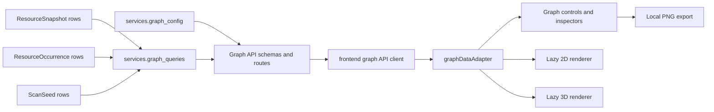

# Site Ledger Website Graph

The Site Ledger website graph is a read-only topology view for one scan. It visualizes Pages already
captured by the static crawler and links already stored as occurrences.

## Architecture



`services.graph_config` owns shared graph limits and capabilities. `services.graph_queries` owns SQL
and topology assembly. Route handlers validate query parameters and return typed responses only.
Frontend code loads capabilities once through TanStack Query, uses application-owned graph types, and
converts them into renderer data through the graph adapter modules.

## Node Semantics

Default nodes represent scan-specific page snapshots and use IDs like `snapshot:123`.

Fetched page nodes include snapshot ID, resource ID, requested URL, final URL, title, host, path,
HTTP status, fetch state, error type, crawl depth, content type, response time, inbound/outbound
counts, scan-seed state, redirect state, and canonical URL.

Optional unfetched internal targets use IDs like `resource:456`. These nodes represent in-scope
resources discovered through occurrences but not fetched in the selected scan. They do not pretend to
have page metadata.

## Edge Semantics

Edges are directed. One edge aggregates all stored `page_link` occurrences from one source snapshot
to one target resource. Duplicate links remain preserved in storage but are summarized in the main
graph response.

Edge summaries include occurrence count, unique anchor text count, nofollow/follow counts, empty
anchor count, self-link state, sample anchors, first/last discovery time, and scope-decision counts.
They also include bounded SQL-aggregated link-role counts. Occurrence details expose the role and
stable classification rule from the source Page's DOM. Roles add evidence without changing edge
identity, ranking, layout, or graph limits.
Full occurrence details load through:

```text
GET /api/scans/{scan_id}/graph/edges/{edge_id}/occurrences
```

The occurrence endpoint verifies scan ownership, preserves duplicates, supports pagination and
search, and returns the same anchor provenance used by existing link views.

## Filters And Limits

`GET /api/scans/{scan_id}/graph` supports bounded filters for host, path prefix, depth, HTTP status
family, fetch state, error state, inbound/outbound thresholds, self-links, unfetched nodes, and
focused neighborhoods.

Defaults:

- `max_nodes=400`
- `max_edges=1200`

Hard caps:

- `max_nodes=3000`
- `max_edges=10000`
- `focus_hops=1..3`

When limits apply, ordering is deterministic: starting page first, then lower crawl depth, stronger
inbound and outbound connectivity, normalized URL, and snapshot ID. Candidate filtering, exact
available-node counts, ranking, and limiting happen in SQL before snapshot rows are loaded into
Python. Edges are returned only when both endpoints are included. The graph summary reports
truncation reasons.

## Neighborhoods

When `focus_snapshot_id` is supplied, the backend verifies that snapshot belongs to the selected
scan. It includes incoming and outgoing neighbors up to `focus_hops` with one batched query per hop,
preserves edge direction, and still enforces hard node and edge limits.

## Rendering

The renderer uses `react-force-graph-2d` for canvas 2D and `react-force-graph-3d` for Three.js 3D.
Imports are isolated inside renderer modules. Controls and pages interact through a small handle:
fit, reset camera, focus node, freeze, reheat, reset layout, and export PNG.

Initial coordinates are deterministic and generated client-side from stable node IDs. Layout state is
not persisted. Reset layout returns nodes to reproducible starting positions; reheating may produce a
different final force layout.

## Interaction

Users can search nodes by title, URL, host, or path. Clicking a node opens a node inspector with
links to page details, inbound links, outgoing links, live URL, and focused neighborhood. Clicking or
selecting an edge opens an edge inspector with source/target actions and paginated occurrence
details.

Node size options: uniform, unique inbound pages, inbound occurrences, unique outbound pages,
outbound occurrences, response time, and crawl-depth inverse.

Color options: HTTP status family, fetch state, crawl depth, host, first path segment, error state,
and seed state. A legend displays the active category labels.

## Export And Presentation

Presentation mode enlarges the graph view without creating a separate route. PNG export captures the
current local canvas and downloads it in the browser. No graph data, image, or layout state is sent to
third-party services.

## Accessibility

Canvas rendering is not the only interaction path. The graph includes a node browser, edge browser,
node inspector, edge inspector, occurrence table, visible controls, and regular links to existing
page-detail routes. Text from scanned pages is rendered as escaped React text, not raw HTML.

## Bundle Behavior

The graph tab lazy-loads renderer modules. The production build emits separate chunks for the 2D and
3D renderers, keeping Three.js-backed 3D code out of the initial application bundle. The 3D chunk is
large and currently triggers Vite's chunk-size warning. Current chunk measurements and dependency
tree notes are tracked in `docs/graph-performance.md`.

## Performance Expectations

The default graph size is intended for interactive inspection of hundreds of pages and low thousands
of edges. The hard cap is 3,000 nodes and 10,000 edges. Larger scans should use filters or focused
neighborhood mode. The graph does not claim support for very large site-wide graphs with tens of
thousands of visible nodes.

## Future Layouts

Future semantic layouts may add Page text extraction, embeddings, projection coordinates, topic
clusters, or similarity edges without changing current topology semantics. Future exploded page
section graphs can add section node kinds and containment edges. Future scan comparison can decorate
nodes and edges as added, removed, changed, or status-changed. None of those persistence models or
algorithms are currently implemented.
