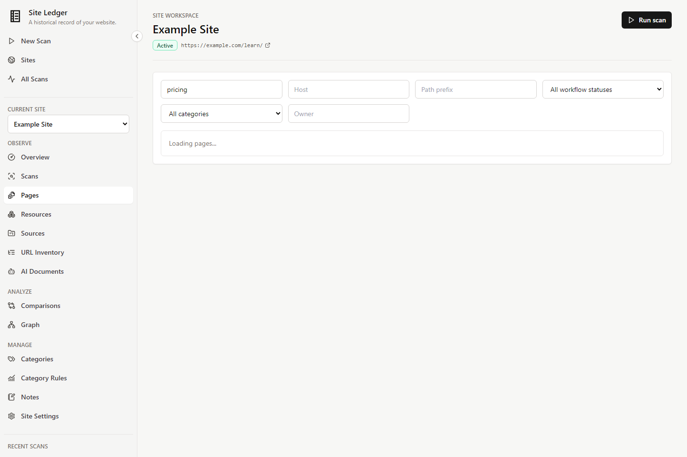
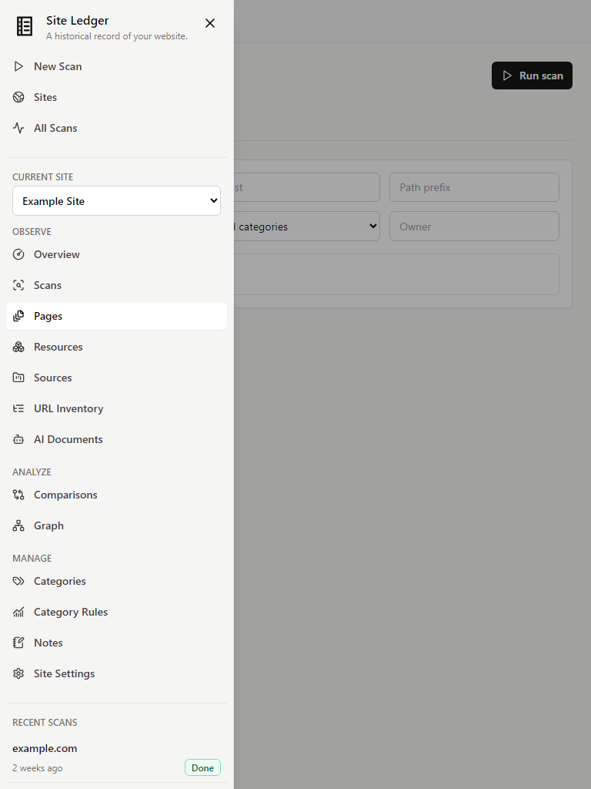
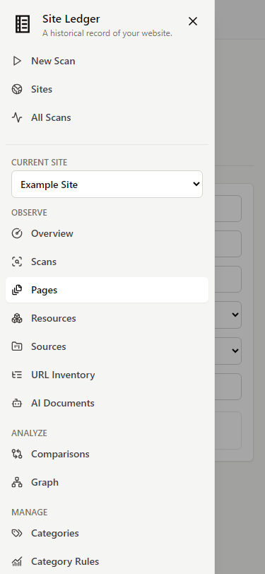

# Product Workspace Navigation

Site Ledger uses a persistent product shell with four levels of context:

1. Global product navigation
2. Current Site
3. Site product area
4. Detail or evidence view

The shell is intentionally a navigation layer. Domain behavior and evidence semantics remain owned by the existing feature components and APIs.

## Global Navigation

The global destinations are:

- **New Scan** (`/scans/new`)
- **Sites** (`/sites`)
- **All Scans** (`/scans`)

Ad hoc Scans remain global records. They do not create a placeholder Site context. A Scan associated with a saved Site links back to that Site's Scans area and is labeled as a saved Site observation.

## Site Workspace

Site routes use `/sites/:siteId` as their stable root. The sidebar is generated from the typed declaration in `frontend/src/navigation/workspaceNavigation.ts`.

### Observe

| Area | Route |
| --- | --- |
| Overview | `/sites/:siteId` |
| Scans | `/sites/:siteId/scans` |
| Pages | `/sites/:siteId/pages` |
| Resources | `/sites/:siteId/resources` |
| Sources | `/sites/:siteId/sources` |
| URL Inventory | `/sites/:siteId/inventory` |
| AI Documents | `/sites/:siteId/ai-documents` |

### Analyze

| Area | Route |
| --- | --- |
| Comparisons | `/sites/:siteId/comparisons` |
| Performance | `/sites/:siteId/performance` |
| Accessibility | `/sites/:siteId/accessibility` |
| Graph | `/sites/:siteId/graph` |

### Manage

| Area | Route |
| --- | --- |
| Categories | `/sites/:siteId/categories` |
| Category Rules | `/sites/:siteId/category-rules` |
| Notes | `/sites/:siteId/notes` |
| Site Settings | `/sites/:siteId/settings` |

Only implemented product areas appear in navigation. Detail routes remain under their owning area, including persistent Pages, Resources, comparison evidence, AI Document Sources, and saved AI Document evidence.

## Active Routes

Active state is determined explicitly from the URL, not by broad prefix matching. For example:

- `/sites/12/pages/44` activates **Pages**, not Overview.
- `/sites/12/comparisons/7/resources/44` activates **Comparisons**, not Resources.
- `/sites/12/performance/runs/7` activates **Performance**.
- `/sites/12/accessibility/rules/image-alt` activates **Accessibility**.
- `/sites/12/ai-documents/evidence/91` activates **AI Documents**.

This ownership rule keeps persistent Page records distinct from Scan Page Observations. Observation routes remain under `/scans/:scanId/pages/:snapshotId`.

## Site Switching

The Site switcher preserves the conceptual product area and discards object-specific state:

- `/sites/12/pages/44` switched to Site 20 becomes `/sites/20/pages`.
- `/sites/12/comparisons/7/pages/44` switched to Site 20 becomes `/sites/20/comparisons`.
- `/sites/12/performance/evidence/91` switched to Site 20 becomes `/sites/20/performance`.
- `/sites/12/accessibility/runs/7` switched to Site 20 becomes `/sites/20/accessibility`.
- `/sites/12/resources/9?tab=history` switched to Site 20 becomes `/sites/20/resources`.

Object IDs and query parameters are never copied to another Site because those values may not exist or have the same meaning there.

## Query State

Filters, pagination, sorting, tabs, and selected records are URL-backed by their owning area. Navigation to another area starts with that area's canonical URL, so unrelated parameters do not leak between Pages, Resources, Sources, URL Inventory, Comparisons, or other workspaces.

Legacy `/sites/:siteId?tab=...` URLs redirect to canonical area routes. Parameters other than `tab` are retained during this one-time compatibility redirect.

## Responsive Behavior

At desktop widths the sidebar is persistent and can collapse to an icon rail. The preference is stored locally in the browser. At mobile and tablet widths the shell uses an off-canvas drawer. Escape, backdrop selection, the close button, and destination navigation close the drawer; focus returns to the menu trigger and body scrolling is restored.

The shell requests only a bounded recent Scan list and a lightweight Site catalog. Site detail data remains owned by the nested Site workspace route and shares the React Query cache with feature surfaces.

## Reference Screenshots

